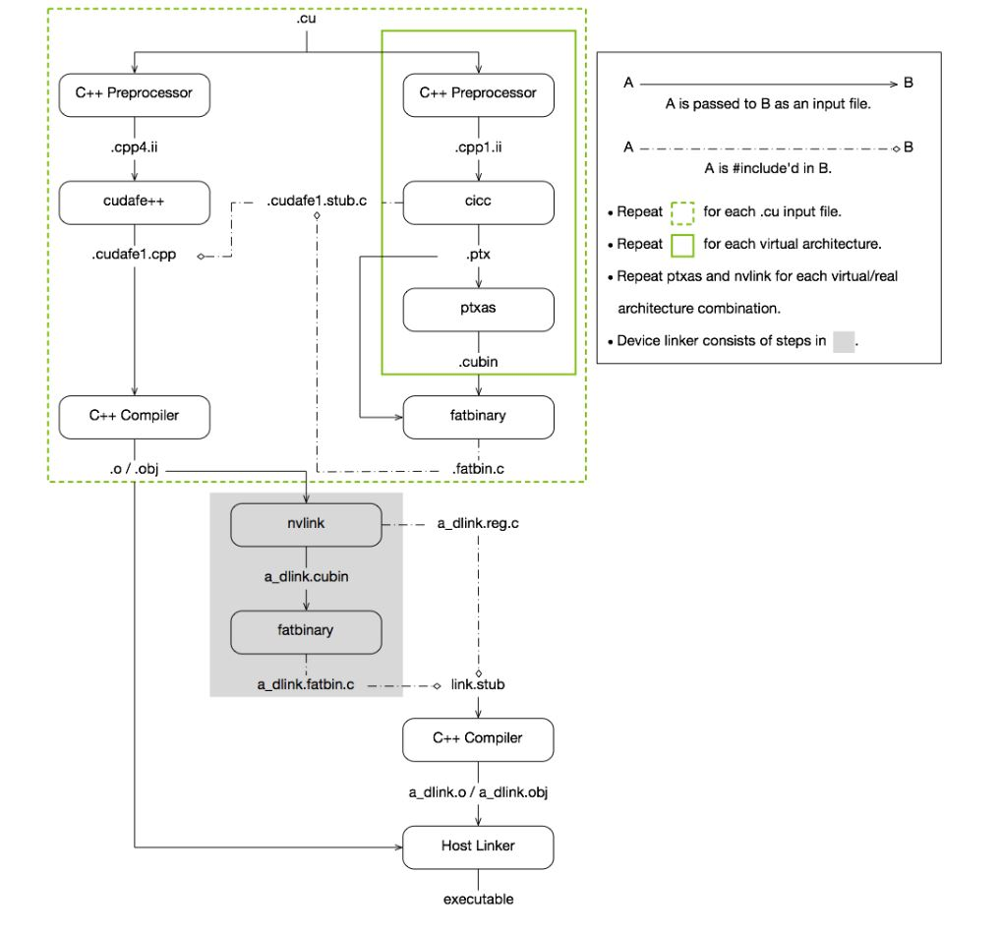
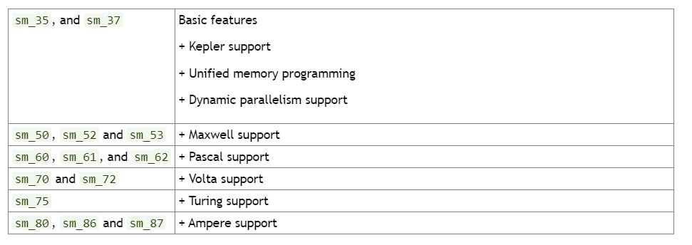
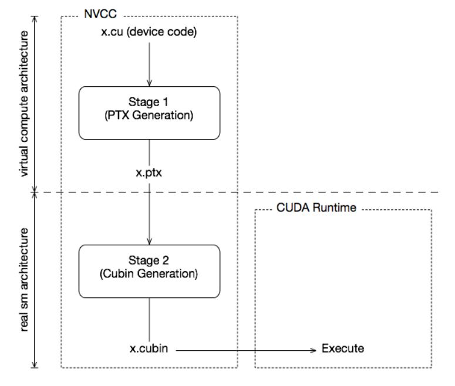
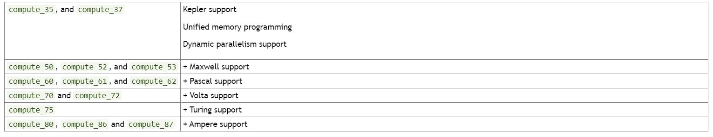
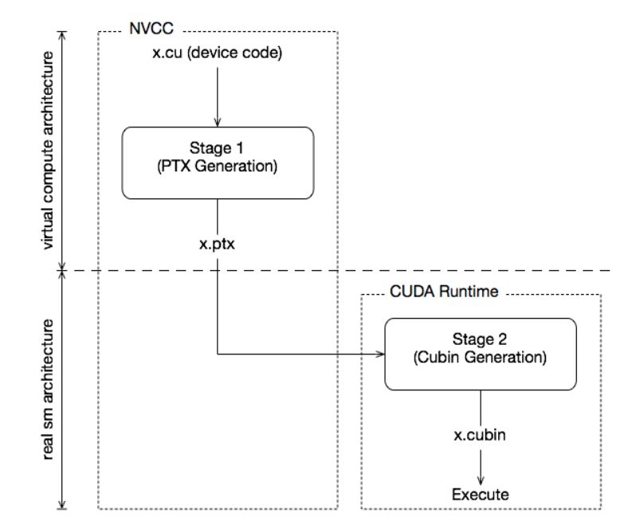

# [The CUDA Compilation Trajectory](https://docs.nvidia.com/cuda/archive/11.6.1/cuda-compiler-driver-nvcc/index.html#cuda-compilation-trajectory)


* CUDA compilation works as follows: the input program is preprocessed for device compilation compilation and is compiled to CUDA binary (cubin) and/or PTX intermediate code, which are placed in a fatbinary. The input program is preprocessed once again for host compilation and is synthesized to embed the fatbinary and transform CUDA specific C++ extensions into standard C++ constructs. Then the C++ host compiler compiles the synthesized host code with the embedded fatbinary into a host object. The exact steps that are followed to achieve this are displayed in Figure 1.
* The embedded fatbinary is inspected by the CUDA runtime system whenever the device code is launched by the host program to obtain an appropriate fatbinary image for the current GPU.
* CUDA programs are compiled in the whole program compilation mode by default, i.e., the device code cannot reference an entity from a separate file. In the whole program compilation mode, device link steps have no effect. For more information on the separate compilation and the whole program compilation, see Using Separate Compilation in CUDA.

# [GPU Compilation](https://docs.nvidia.com/cuda/archive/11.6.1/cuda-compiler-driver-nvcc/index.html#gpu-compilation)

<br>

## [GPU Generations](https://docs.nvidia.com/cuda/archive/11.6.1/cuda-compiler-driver-nvcc/index.html#gpu-generations)

In order to allow for architectural evolution, NVIDIA GPUs are released in different generations. New generations introduce major improvements in functionality and/or chip architecture, while GPU models within the same generation show minor configuration differences that moderately affect functionality, performance, or both.

Binary compatibility of GPU applications is not guaranteed across different generations. For example, a CUDA application that has been compiled for a Fermi GPU will very likely not run on a Kepler GPU (and vice versa). This is the instruction set and instruction encodings of a generation is different from those of of other generations.

Binary compatibility within one GPU generation can be guaranteed under certain conditions because they share the basic instruction set. This is the case between two GPU versions that do not show functional differences at all (for instance when one version is a scaled down version of the other), or when one version is functionally included in the other. An example of the latter is the base Maxwell version sm_52 whose functionality is a subset of all other Maxwell versions: any code compiled for sm_52 will run on all other Maxwell 

为了允许架构演进，NVIDIA GPU 在不同的世代中发布。 新一代在功能和/或芯片架构方面进行了重大改进，而同一代中的 GPU 模型显示出轻微的配置差异，这些差异会适度影响功能、性能或两者。

不保证跨不同代的 GPU 应用程序的二进制兼容性。 例如，为 Fermi GPU 编译的 CUDA 应用程序很可能无法在 Kepler GPU 上运行（反之亦然）。 这是指令集和指令编码，一代与其他代不同。

在特定条件下可以保证一代 GPU 的二进制兼容性，因为它们共享基本指令集。 这是两个完全没有显示功能差异的 GPU 版本之间的情况（例如，当一个版本是另一个版本的缩小版本时），或者当一个版本在功能上包含在另一个版本中时。 后者的一个例子是基本的 Maxwell 版本 sm_52，其功能是所有其他 Maxwell 版本的子集：为 sm_52 编译的任何代码都将在所有其他 Maxwell GPU 上运行。

## [GPU Feature List](https://docs.nvidia.com/cuda/archive/11.6.1/cuda-compiler-driver-nvcc/index.html#gpu-feature-list)




## [Applicatioin Compatibility](https://docs.nvidia.com/cuda/archive/11.6.1/cuda-compiler-driver-nvcc/index.html#application-compatibility)

nvcc relies on a two stage compilation model for ensuring application compatibility with future GPU generations.

## [Virtual Architectures](https://docs.nvidia.com/cuda/archive/11.6.1/cuda-compiler-driver-nvcc/index.html#virtual-architectures)

GPU compilation is performed via an intermediate representation, PTX, which can be considered as assembly for a virtual GPU architecture. Contrary to an actual graphics processor, such a virtual GPU is defined entirely by the set of capabilities, or features, that it provides to the application. In particular, a virtual GPU architecture provides a (largely) generic instruction set, and binary instruction encoding is a non-issue because PTX programs are always represented in text format.

GPU 编译是通过中间表示 PTX 执行的，它可以被视为虚拟 GPU 架构的组装。 与实际的图形处理器相反，这样的虚拟 GPU 完全由它提供给应用程序的功能或特性集来定义。 特别是，虚拟 GPU 架构提供（大部分）通用指令集，二进制指令编码不是问题，因为 PTX 程序始终以文本格式表示。



## [Virtal Architecure Feature List](https://docs.nvidia.com/cuda/archive/11.6.1/cuda-compiler-driver-nvcc/index.html#virtual-architectures)

virtal architecture和real architecture的明白方案相同：



## [Further mechanisms](https://docs.nvidia.com/cuda/archive/11.6.1/cuda-compiler-driver-nvcc/index.html#further-mechanisms)

*  **Just-in-Time Compilation**
   *  For example, compiling to sm_52 allows the code to run on all Maxwell-generation GPUs, but compiling to sm_53 would probably yield better code if Maxwell GM206 and later are the only targets.
   *  By specifying a virtual code architecture instead of a real GPU, nvcc postpones the assembly of PTX code until application runtime, at which the target GPU is exactly known.
   *  `nvcc x.cu --gpu-architecture=compute_50 --gpu-code=compute_50`
   *  
*  **Fatbinaries**
   *  `nvcc x.cu --gpu-architecture=compute_50 --gpu-code=compute_50,sm_50,sm_52`
   *  This command generates exact code for two Maxwell variants, plus PTX code for use by JIT in case a next-generation GPU is encountered. nvcc organizes its device code in fatbinaries, which are able to hold multiple translations of the same GPU source code. At runtime, the CUDA driver will select the most appropriate translation when the device function is launched.


## [NVCC Examples](https://docs.nvidia.com/cuda/archive/11.6.1/cuda-compiler-driver-nvcc/index.html#nvcc-examples)
* **Base Notation**
  * nvcc provides the options --gpu-architecture and --gpu-code for specifying the target architectures for both translation stages. Except for allowed short hands described below, the --gpu-architecture option takes a single value, which must be the name of a virtual compute architecture, while option --gpu-code takes a list of values which must all be the names of actual GPUs. nvcc performs a stage 2 translation for each of these GPUs, and will embed the result in the result of compilation (which usually is a host object file or executable).
  * `nvcc x.cu --gpu-architecture=compute_50 --gpu-code=sm_50,sm_52`
* **Shorthand**
  * --gpu-code arguments can be virtual architectures. In this case the stage 2 translation will be omitted for such virtual architecture, and the stage 1 PTX result will be embedded instead. At application launch, and in case the driver does not find a better alternative, the stage 2 compilation will be invoked by the driver with the PTX as input.
  * --gpu-code 参数可以是虚拟架构。 在这种情况下，此类虚拟架构的第 2 阶段翻译将被省略，而第 1 阶段 PTX 结果将被嵌入。 在应用程序启动时，如果驱动程序没有找到更好的替代方案，则驱动程序将以 PTX 作为输入调用第 2 阶段编译。
  * `nvcc x.cu --gpu-architecture=compute_50 --gpu-code=compute_50,sm_50,sm_52`
  * The --gpu-code option can be omitted. Only in this case, the --gpu-architecture value can be a non-virtual architecture. The --gpu-code values default to the closest virtual architecture that is implemented by the GPU specified with --gpu-architecture, plus the --gpu-architecture, value itself. The closest virtual architecture is used as the effective --gpu-architecture, value. If the --gpu-architecture value is a virtual architecture, it is also used as the effective --gpu-code value.
  * 
    ```
    nvcc x.cu --gpu-architecture=sm_52
    nvcc x.cu --gpu-architecture=compute_50
    ```
  * are equivalent to
    ```
    nvcc x.cu --gpu-architecture=compute_52 --gpu-code=sm_52,compute_52
    nvcc x.cu --gpu-architecture=compute_50 --gpu-code=compute_50
    ```
  * Both --gpu-architecture and --gpu-code options can be omitted.
  * `nvcc x.cu` is equivalent to `nvcc x.cu --gpu-architecture=compute_52 --gpu-code=sm_52,compute_52`
* **[Extended Notation](https://docs.nvidia.com/cuda/archive/11.6.1/cuda-compiler-driver-nvcc/index.html#extended-notation)**
  * 注意`--gpu-architecture`, `--gpu-code`, `--generate-code`的使用区别，具体请参见原链接。
* **[Virtual Architecture Macros](https://docs.nvidia.com/cuda/archive/11.6.1/cuda-compiler-driver-nvcc/index.html#virtual-architecture-macros)**
  * The architecture identification macro __CUDA_ARCH__ is assigned a three-digit value string xy0 (ending in a literal 0) during each nvcc compilation stage 1 that compiles for compute_xy.
  * For example, the following nvcc compilation command line will define __CUDA_ARCH_LIST__ as 500,530,800 :
    ```
    nvcc x.cu \
    --generate-code arch=compute_80,code=sm_80 \
    --generate-code arch=compute_50,code=sm_52 \
    --generate-code arch=compute_50,code=sm_50 \
    --generate-code arch=compute_53,code=sm_53
    ```


## Reference 

1. [NVCC](https://docs.nvidia.com/cuda/archive/11.6.1/cuda-compiler-driver-nvcc/index.html)
2. [CUDA Compilation](https://leimao.github.io/blog/CUDA-Compilation/)
3. 