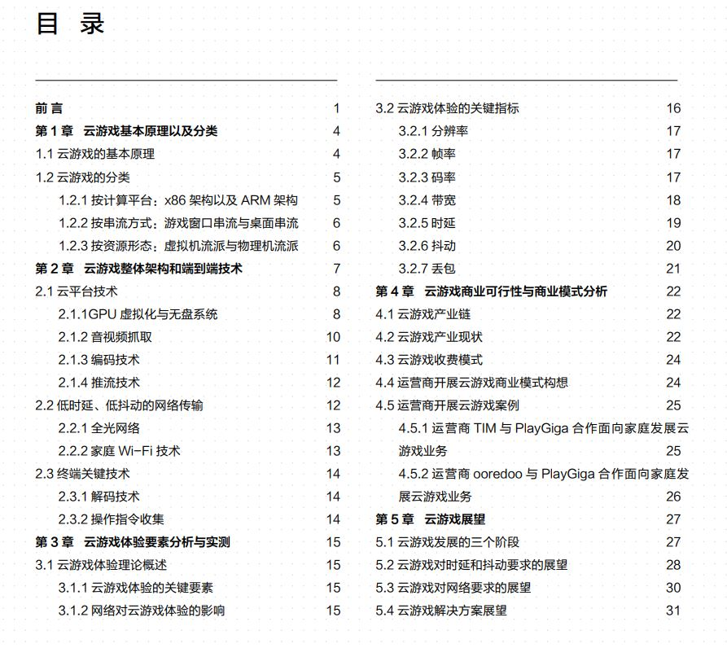
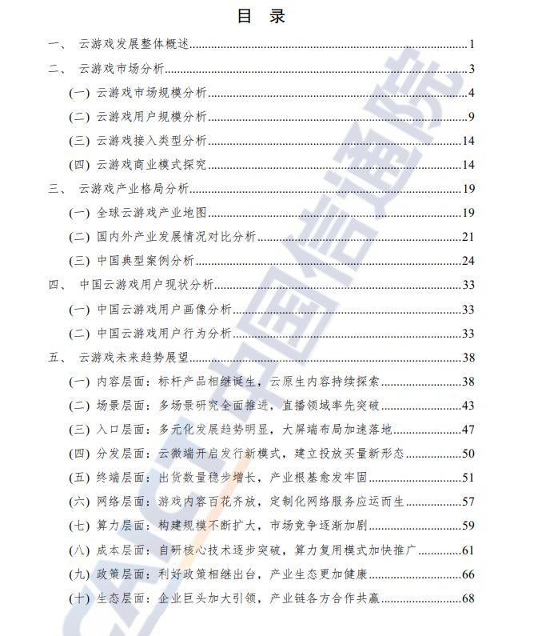

## 常见术语及解释

1. 视频编码技术：H.264, H.265, H.266是什么？
2. 云游戏现在的付费模式是什么？
3. 4G和5G的区别是什么？
4. 5G的成本？
5. 了解一下虚拟化技术？
6. nvidia gpu的grid和mig的区别是什么？
7. H264/H265、VP9、AV1编码算法？
8. 什么是云原生？
9. [什么是Nvidia GeForce Now，它是免费的吗？它可以与哪些设备一起使用？](https://0xzx.com/2021031823531273633.html)

## 资料整理

 

### 1. [云游戏关键技术研究报告(2020年)](http://qccdata.qichacha.com/ReportData/PDF/c3a22a01eb69df48243798e565b84d11.pdf)
   * 来源：中国信息通信研究院和5G云游戏产业联盟
   * 由于云游戏技术架构可复用于其他高算力、大视频流交互场景，未来有望打破场景界限，实现技术资源复用，创造出更多更新的需求和体验
   * 技术发展历程 
     * 云游戏本质是在线交互性流媒体。
     * 虚拟化和编解码技术助力云游戏产品萌芽
       * H.264/AVC 标准的提出进一步提高了视频编码效率，AVS 视频编码标准的制定实现了编码复杂冗余同编码效率的折中，云游戏视频编码技术的发展使得渲染后的画面质量以及占用带宽得到了进一步的平衡优化；
       * OFDM 技术、智能天线技术以及 MIMO 技术等相关核心技术的发展使得网络传输信号质量以及网络传输容量得到大幅度提升。
     * 云计算技术提升推动云游戏进入预热阶段
       * 2015 年，索尼收购 OnLive 以提供技术支持，同时推出 Playstation Now，允许 PS4 以及 PC 用户通过串流方式运行 PS2-4 上的高质量游戏。
       * 2017 年英伟达为 PC 和 Mac 推出了单独的云游戏服务 GeForce Now
       * 2018 年微软正式公布新云游戏服务Project xCloud。
       * HEVC/H.265、FVC 等编码标准的提出以及相关视频编解码技术的应用使得云游戏视频画面传输质量以及编码效率得到进一步优化。
     * 5G 弥补传输短板，云游戏进入全面发展期
       * 2019 年 GDC 大会谷歌发布 Stadia 云游戏平台，再次将云游戏推向风口。
       * 2020 年 9 月，微软公司云游戏服务 xCloud 正式上线；
       * 同期，亚马逊宣布推出 Luna 云游戏服务。
     * 云游戏是信息通信技术融合更迭的领跑者
   * 技术架构总览
     * 谁、用什么、做什么和怎么做？
     * 云游戏构成要素包括云游戏开发平台、云游戏运营平台、云游戏服务平台、网络资源、终端设备和游戏应用。
     * 云游戏的功能架构可分为终端、网络、云端、其他和跨层五个不同层级。
   * 关键技术剖析
     * 5G 技术赋能云游戏移动端便携属性
       * 增强移动宽带（eMBB）、超高可靠低时延通信（uRLLC）和海量机器类通信（mMTC）是 5G 典型的三大应用场景。
       * 云游戏高带宽需求
         * 高清云游戏(1080P 30fps)在 H264 编码条件下，码率可达 8000Kbps 左右，网络带宽需达到 10Mbps 才能稳定流畅运行。随着应用终端扩展到大屏电视、VR 等设备，对分辨率和帧率的要求逐步提高(4K/8K，60fps/120fps)，码率也随之提高。初步估算，4K 60fps 的超高清云游戏码率(H264 编码)大概在 60Mbps到 70Mbps，考虑网络抖动因素后，需至少 80Mbps 网络带宽才能保持稳定流畅运行。
         * 截至2018年2月，全球4G平均网速为16.9Mbit/s；
         * 目前，华为在实地测试中已实现的 5G 网速记录为 3.67Gbit/s
       * 云游戏低延迟需求
         * 操作响应延迟要求较高的游戏（例如:动作类、格⽃类、MOBA 类、第一人称射击类、赛车类等）
         * VR 设备由于其头显的特殊性，延迟较大时会使人产生晕动症 (motion sickness)，需要把延迟控制在20ms 以内才能有效控制排斥反应。
         * 据学者研究，以某云游戏 Demo 166ms 时延为例，包括输入、操作网络传输、云端游戏渲染、视频网络传输和解码等时延，其中网络传输时延竟高达 120ms，占比总延迟的 70%以上。
         * 这部分还要再看一下
       * 云游戏网络稳定性（低抖动）需求
         * 一是相连帧到达终端的时间差变大，可能导致终端显示完当前帧，但下一帧却没有及时到达，从而造成画面的停顿现象
         * 二是相连帧同时到达终端，这可能会导致终端只显示最新帧，从而造成画面的跳帧现象。
         * 5G 切片技术可为云游戏提供其运行所需的稳定网络。
           * 网络切片利用网络虚拟化技术，可根据云游戏场景的网络需求，实现定制化的云游戏专用网络环境，从而满足无抖动的网络需求。
     * 云游戏也是 5G 技术落地的重要应用场景。
       * 5G 技术虽然实现了“速度提升”，但是却“无人使用”的尴尬。
     * 边缘计算实现网络带宽与时延的双赢
       * 边缘计算是云计算的延伸，是云计算下沉到户侧的触点。
       * 边缘计算技术使得云游戏在保障网络带宽的同时降低端到端时延成为可能。
       * 边缘计算是运营技术、信息技术以及通讯技术三者的融合。
     * 虚拟化/容器技术提升资源使用效率
       * 容器/虚拟化技术是云游戏运行环境的基石
       * 云游戏的虚拟化/容器方案与服务端硬件架构、客户端展现形式紧密联动，形成了不同路径的云游戏技术实现架构。
       * 由于 Linux 系统在现有游戏中使用率不高，云游戏现有的虚拟化方案分为基于 Windows（X86）架构的虚拟化/容器方案，以及基于 Android 的容器技术。
       * 软件层面。就云游戏的场景需求而言，可以分为两类虚拟化技术，一类是基于管理程序 Hypervisor 的桌面虚拟化技术，另一类是基于 Sandboxie 的进程虚拟化技术。
       * 桌面虚拟化展现了良好的应用兼容性，但是虚拟化软件对硬件性能损耗比较大，单机的并发数量不高；进程虚拟化的并发会大大提高，但是应用的兼容性比较受限。
     * 高密度 GPU 助力云游戏实现算力飞跃
       * 相比于传统桌面 GPU，用于云游戏的 GPU 应该具备更多技术特性：一是渲染多路游戏，能够相互隔离；二是具有超强的编码能力，可降低云游戏延迟；三是具备多图形接口支持，OpenGL、OpenGL ES、vulkan、OpenCL，多种纹理格式均需要支持。
       * GPU 虚拟化技术。
         * 透传通过虚拟机的方式将虚拟系统与真实 GPU 一对一绑定，使虚拟机可以直接使用 GPU 获取其 3D 加速能力。
         * 当前主流 GPU 虚拟化方案有 Nvidia 的 GRID、AMD 的 MxGPU 和的 Intel GVT-g，谷歌 Stadia 云游戏平台采用的AMD S7150 显卡也使用的是这种虚拟模式。
       * 高性能传输接口技术
         * 当前高性能云服务 GPU 通常会选择 PCIe Gen4x16 接口，来应对 20 路以上的虚拟化应用。
       * 高性能内存接口技术
         * HBM 技术和 GDDR6技术
       * 多芯片级联技术
         * NVDIA 的 NVLINK 方案和 AMD 的 chiplet方案。
     * 流媒体技术开启用户视听体验新篇章
       * 流媒体技术是一种处理可实时传输流媒体文件的网络传输技术。其实现基理是将连续的影像和声音信息在服务端进行复杂的压缩/编码处理，继而通过网络按照一定逻辑向用户终端实时传送，最终实现用户端的即点即看功能
       * 云游戏涉及的流媒体技术主要包括视频流的编码、推拉流（传输）和解码。
       * 云游戏流媒体传输的推拉流协议以 TCP(RTMP)协议和 UDP(RTP)协议为主
       * 当前应用于云游戏的主流视频压缩算法是 H264。相较于 H264，虽然 H265、VP9、AV1 具有更高的压缩比，在传输方面具有很大优势，但也会给其编解码效率(时间)带来一定损失。
       * 云游戏的视频传输需要流媒体技术在达到通用能力基础上，还可实现零丢包，抗抖动和动态码流调整等目标。
       * 从编码协议来看，未来将逐渐从 H.264 向压缩比更高，更为节省传输流量的新技术迁移；从编码技术来看，Intel、AMD 以及 nVidia 等大厂将聚焦硬编码技术更新，以提高编码执行效率和画面质量；从推拉流协议来看，当前没有一个既定的标准协议完全适用于云游戏场景
   * 云游戏标准化体系
     * 系统性能参数
       * 分辨率
       * 帧率
       * 码率
       * 带宽
       * 时延
       * 抖动

 

### 2. [云游戏发展到哪一步了？能玩，但还不够 【笔吧】](https://www.bilibili.com/video/BV1qg411p7fK/?spm_id_from=333.337.search-card.all.click&vd_source=2ef7e92f2d522c31939f486aea77a19e)
  * 对比了
    * 顺网云
    * 菜机云
    * 网易云
    * START（腾讯的）游戏少，质量相对高，价格相对合适
    * 斗鱼云
    * YOWA
    * Xbox云游戏  需要XGPU，质量高，价格相对合适
    * Geforce Now 质量高，价格也相对高
  * 延迟也是上述提到的三种相对还可以
  * Geforce Now的白金方案2388元/年，每天游戏时长6小时

 

### 3. [开国元老都倒闭了，云游戏的未来到底在哪里？](https://www.bilibili.com/video/BV12e4y1E7Wa/?spm_id_from=333.337.search-card.all.click&vd_source=2ef7e92f2d522c31939f486aea77a19e)
  * 关于google云游戏平台stadia关停的讨论，云游戏是好是坏，还是判断不出来。

 

### 4. [云游戏白皮书 (HUAWEI & 顺网科技) (2019.12)](https://www-file.huawei.com/-/media/corporate/pdf/ilab/2019/cloud_game_whitepaper.pdf)
  * 大体方案结构与1的内容相似，内容写的更好一些，之后详细看一下，TODO
  * 
  * 云游戏商业可行性与商业模式分析
    * 
    * 
  * 云游戏解决方案展望
    * 

 

### 5.[全球云游戏产业深度观察及趋势研判研究报告 (2022年)](https://pdf.dfcfw.com/pdf/H3_AP202203181553448373_1.pdf?1647636501000.pdf)
   * 
   * 云游戏市场规模分析
   * 
   * 海外云游戏市场收入分析
   * 
   * 中国典型案例分析 
   * 中国云游戏案例—阿里巴巴云游戏（元境）
   * 
   * 中国云游戏案例—海马云
   * 
   * 中国云游戏案例—视博云
   * 中国云游戏案例—上海达龙
   * 中国云游戏案例—腾讯
   * 中国云游戏案例—蔚领时代
   * 
   * 中国云游戏案例—云天畅想
   * 
   * 蔚领时代作为《云·原神》的独家云游戏服务供应商，用其自主研发的创新云计算架构以及音视频实时编解码、应用容器多开技术、自动降码及基于 MRSP 的弱网优化等核心技术，结合阿里云、金山云等公有云的优质底层 IaaS 资源，搭建了一套一站式的云游戏 PaaS平台，为用户提供“超高清、低延时”的良好游戏体验。《云·原神》带来的一系列市场口碑效应，也极大的证明了蔚领时代团队的研发与技术实力。
   * 场景层面：多场景研究全面推进，直播领域率先突破
     * 在国外，大型互动直播游戏表现最佳
       * [《Rival Peak》是未来游戏的样子么？](https://zhuanlan.zhihu.com/p/346926937) 
         * 大家之前还只是用弹幕去玩一个已经玩过的游戏，那能不能有一款新的游戏就是为了互动玩法而生呢？
         * 《Rival Peak》将活动场景设置在一座山林中，12 名由 AI 驱动的参赛者需要团结协作、解决谜题，力争生存到最后。而这些参赛者会做出何种行为，则完全由在线观众所决定。在这场没有脚本的直播中，观众才是真正的幕后推手。
       * [云游戏+ AI +直播，《Rival Peak》是否会成为未来游戏的雏形？](https://zhuanlan.zhihu.com/p/364106437)
   * 入口层面：多元化发展趋势明显，大屏端布局加速落地
   * 腾讯云渲染
     * 云上南头古城
       * [文旅元宇宙：云上漫游南头古城](https://www.bilibili.com/video/BV1DG411n7i7/?spm_id_from=333.337.search-card.all.click&vd_source=2ef7e92f2d522c31939f486aea77a19e)
       * [一键“云”上漫游南头古城是一种什么体验？腾讯云云渲染厉害了！](https://cloud.tencent.com/developer/article/1827177)
       * [小程序-云上南头古城](https://www.bilibili.com/video/BV1KK411X7WB/?spm_id_from=333.337.search-card.all.click&vd_source=2ef7e92f2d522c31939f486aea77a19e)
     * 三星堆云考古 

 

### 6. [云游戏报告：2022年中国云游戏市场规模45亿元，月活用户达9600万](http://www.gamelook.com.cn/2023/01/506925)
  * 行业发展逐渐明朗，预计2024年市场规模破百亿
  * 中国厂商抓住了“内容为王”这个硬道理，将大量高人气游戏云化，除了《云·原神》，腾讯、网易也都推出了如《云·天涯明月刀手游》《云·梦幻西游》《云·阴阳师》等产品，通过头部产品的影响力，带动大量玩家尝试并使用云游戏
  * 报告显示，2022年中国热门云游戏TOP10分别是《原神》《迷你世界》《崩坏3》《明日方舟》《英魂之刃》《保卫萝卜4》《汤姆猫跑酷》《球球大作战》《最终幻想15》以及《航海王热血航线》。
  * 手机是主要应用场景，云游戏更受年轻人喜爱
  * 报告指出，根据调研数据显示，延时高、画面不流畅、卡顿等仍是主要痛点，有43.6%的玩家在使用中曾遇到过这样的问题，其次则是免费时间较短、排队时间较久等问题。

 

### 7. [2022年中国云游戏行业研究报告](https://36kr.com/p/2004935525322886)

 

### 8. [云游戏技术的过去、现在，和未来](https://imgtec.eetrend.com/blog/2021/100114350.html)

  

### 9.[揭秘 Meta 的云游戏基础设施](https://www.infoq.cn/article/oi5qfvo5nuchezscpaib)
  * 原文：[Under the hood: Meta’s cloud gaming infrastructure](https://engineering.fb.com/2022/06/09/web/cloud-gaming-infrastructure/)

 

### 10.[技术解码 | 云游戏实现技术解析](https://cloud.tencent.com/developer/article/1700745)

 

### 11.[云游戏基础架构概览](https://cloud.google.com/architecture/cloud-game-infrastructure?hl=zh-cn)

 

### 12.[Cloud video games have a rocky history, but could have a bright future](https://fortune.com/2022/11/04/cloud-video-games-future-stadia-xbox-microsoft-google-sony/)

 

### 13.[2023年中国云游戏行业全景图谱](https://www.qianzhan.com/analyst/detail/220/221223-31ec4432.html)
  * 和之前很多内容有重合。