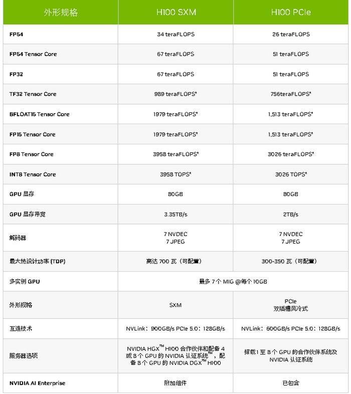

## 

> H100 is NVIDIA’s 9th-generation data center GPU designed to deliver an order-of-magnitude performance leap for large-scale AI and HPC over our prior generation NVIDIA A100 Tensor Core GPU. H100 carries over the major design focus of A100 to improve strong scaling for AI and HPC workloads, with substantial improvements in architectural efficiency.
>
> H100 是 NVIDIA 的第 9 代数据中心 GPU，旨在为大规模 AI 和 HPC 提供比上一代 NVIDIA A100 Tensor Core GPU 数量级的性能飞跃。 H100 继承了 A100 的主要设计重点，以提高 AI 和 HPC 工作负载的强大扩展能力，并大幅提高架构效率。
>
> For today’s mainstream AI and HPC models, H100 with InfiniBand interconnect delivers up to 30 times the performance of A100 (see Figure 3).
>
> 对于当今主流的 AI 和 HPC 模型，采用 InfiniBand 互连的 H100 可提供高达 A100 30 倍的性能（见图 3）。

## BLOG

* ### [国内外AI芯片、算力综合对比](https://www.eet-china.com/mp/a229033.html)
  * 很好的一篇blog，需要再deep dive

* ### [NVIDIA H100 PCIe vs. SXM5 Form Factors](https://www.arccompute.io/arc-blog/nvidia-h100-pcie-vs-sxm5-form-factors-which-gpu-is-right-for-your-company)
  * 无论是PCIe板还是SXM板，GPU与GPU之间的互联都是可以通过NVLink进行链接的
  * SXM板可以使用NVSwitch？？？

* ### [NVIDIA H800 AI加速卡，特供中国市场，NVlink带宽缩水，百度、腾讯和阿里巴巴都已采购](https://www.fashaoyou.net/archives/16760)
  * 
  * SXM版本的NVLink比PCIe版本的NVLink具有更高的带宽？