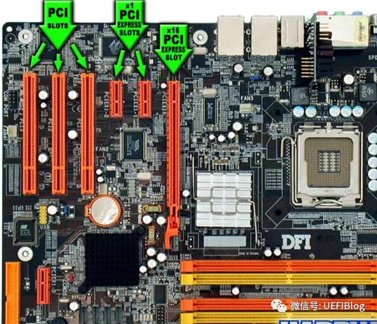
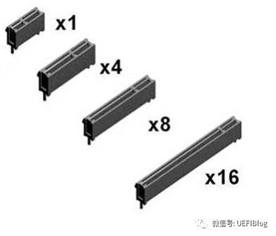
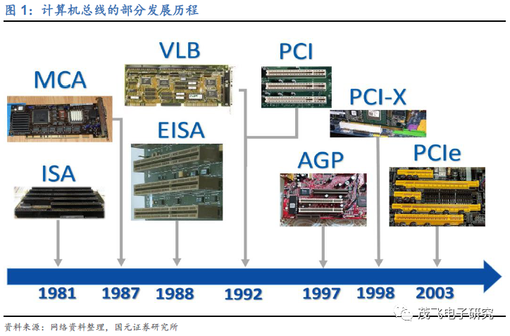
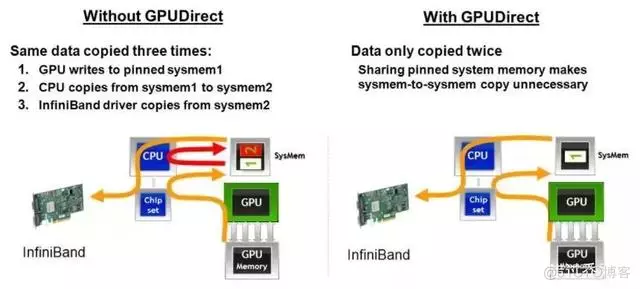
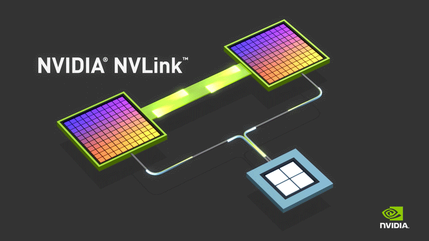

# Bus

  

## PCIE

1. [深入PCI与PCIe之一：硬件篇](https://zhuanlan.zhihu.com/p/26172972)
   * 这一篇可以细看一下
   * 2004年，Intel再一次带领小伙伴革了PCI的命。PCI express（PCIe，注意官方写法是这样，而不是PCIE或者PCI-E）诞生了，其后又经历了两代，现在是第三代(gen3，3.0)，gen4有望在2017年公布，而gen5已经开始起草中。
   * 
   * 

2. [深入PCI与PCIe之二：软件篇](https://zhuanlan.zhihu.com/p/26244141)
   * 这一篇之后也深入看一下。

3. [计算机组成原理 — PCIe 总线](https://bbs.huaweicloud.com/blogs/291910)
    * 具体请参见链接； 
    * PCI 插槽都是等长的，防呆口位置靠上，大部分都是纯白色。PCIe 插槽大大小小，最小的 x1，最大的 x16，防呆口靠下。
    * PCI 总线属于共享并行互联结构，系统的各种设备共用一个带宽，这极大影响了系统的整体性能，而且并行通信的串扰问题也严重制约了日后速度的进一步提升。而 PCI-E 总线则采用了串行互联的方式，以点对点的形式进行数据传输，也就是说每个设备都有自己的专用连接，可以独享带宽，而不必向共享总线请求带宽。一个标准的 PCI-E 连接可以包含多个信道（Lane），当需要增加数据传输带宽时，可以通过增加信道的数量来达到目的。单个信道的 PCI-E 可以提供单向 250MB/s 的带宽，PCI-E * 16 信道则可以提供 4GB/s 的带宽。PCI-E 相对于 PCI 大大的提高了传输速率，而且也为更高的频率提升创造了条件。
    * PCI-E 支持对 PCI 和 PCI-X 的软件兼容，但主板上得到接口插槽却不兼容，因为 PCI-E 是串行接口，针数会更少，插槽会更短，PCI-E 插槽的长度跟信道的数目有关。

4. [澜起科技深度分析：为什么PCIe总线是未来的趋势？](https://ee.ofweek.com/2021-04/ART-8460-2801-30495664.html)
    * PCIe(Peripheral Component Interconnect Express)是一种高速计算机数据传输总线,该总线连接外部硬件设备的接口被称为PCIe接口。总线是计算机主板上进行不同设备间数据交互的通路,其单位时间内的数据传输量被称作带宽,随着电脑技术与下游应用的发展,从过去高清视频、3A游戏、视频剪辑的出现到现在人工智能、云交互技术的成熟,下游用户对总线的带宽要求越来越高,从最早伴随第一台计算机诞生的ISA总线,到现在的PCIe总线,这其中经历了数次更新与迭代。目前,PCIe总线已经成为了主流应用中传输速度最快的总线。
    * 

5. [M.2硬盘与PCI-E硬盘的区别](https://www.crucial.cn/articles/about-ssd/m2-vs-pcie)
     * PCI Express的接口根据总线位宽不同，还可分为X1、X4、X8和X16。目前使用较多的是PCIe X4，市面上流通较多的是PCI-E 2.0版本和3.0版本，对应的X4带宽为16Gbps/32Gbps，折算成传输速率约为2GB/s和3.93GB/s，相比SATA接口，这已经是非常恐怖的速率了。

   

## NVLINK

1. [NVLink究竟是个啥？](https://blog.51cto.com/bantu/5161354)
    * NVIDIA推出了能够提升GPU通信性能的技术——​​GPUDirect P2P技术​​（使GPU可以通过PCI Express直接访问目标GPU的显存，避免了通过拷贝到CPU host memory作为中转，大大降低了数据交换的延迟），​​但受限于PCI Express总线协议以及拓扑结构的一些限制​​，无法做到更高的带宽，为了解决这个问题，​​NVIDIA提出了NVLink总线协议​​。
    * 
    * PCI Express现状
      * 目前​PCIe 4.0协议​，相较PCIe 3.0已实现带宽翻倍，​x16双向带宽达到了64GB/s​，而搭载HBM2e显存的NVIDIA A100带宽已可达到​1935GB/s​。显卡核心和显存之间的数据交换通道已经达到如此带宽，​但是​GPU​之间以及​GPU​和​CPU​之间的数据交换受到PCIe总线影响，成为了瓶颈​。
    * NVLink
      * 为解决PCI Express下的瓶颈，NVIDIA推出了NVLink，​​可提供更高带宽和更多链路，并可提升多GPU系统配置的可扩展性​​，有效解决互连问题。于2016年发布的P100是搭载NVLink的第一款产品，具有​​160 GB/s​​的带宽，相当于​​PCIe Gen3*16带宽的5倍​​。GTC 2017上发布的V100搭载NVLink 2.0，更是将带宽提升到了​​300 GB/s​​，差不多达到了​​PCIe Gen4*16带宽的5倍​​。而在去年GTC 20中最新发布的NVIDIA A100更是搭载了​​NVLink 3.0​​，单个NVIDIA A100 Tensor核心GPU支持多达12个第三代NVLink连接，​​总带宽为每秒600 GB/s，几乎是PCIe Gen 4带宽的10倍。
      * 

2. [GPU前沿：NVLink与PCIe的对比学习](https://zhuanlan.zhihu.com/p/347353435)

   

## SDI

1. [SDI, DVI, HDMI, DisplayPort的区别](https://codeantenna.com/a/vZd8HLcQk0)
   * HDMI（High Definition Multimedia），中文解释就是高清晰度多媒体接口，支持HDCP，主要用于消费类电子产品上。
     * HDMI接口可以提供高达5Gbps的数据传输带宽，可以传送无压缩的音频信号及高分辨率视频信号，同时无需在信号传送前进行数/模或者模/数转换，可以保证最高质量的影音信号传送。与DVI相比，HDMI可以看成是DVI接口的强化与延伸，HDMI在传输数字视频信号的同时还可以传输数字音频信号（即音频/视频采用同一电缆），并增加了对HDCP的支持，同时提供了更好的DDC可选功能。
   * DVI（Digital Video Interface），数字视频接口。
     * DVI接口仅能传输视频数据，无法传输音效信号，如果硬件符合相关规格，此接口也可传输HDCP讯号。
   * SDI接口是数字分量串行接口(serial digital interface)的首字母缩写。
     * SDI是专业的视频传输接口，一般用于广播级视频设备中。SDI和HDMI这两个接口都支持无压缩数字视频传输，但HDMI接口要用19根线了传输，SDI用普通的75欧姆同轴线就可以。HDMI目前最长只能传输40米，SDI可以传输120－400米。
     * HDMI和SDI应用的领域不同，不会产生冲突，HD－SDI只能做到1080I，现在最新版本的是3G－SDI，可以做到1080P。
   * DisplayPort也是一种高清数字显示接口标准，可以连接电脑和显示器，也可以连接连接电脑和家庭影院。
     * HDMI的出现取代了模拟型号视频，而DisplayPort的出现则取代的是DVI和VGA接口。