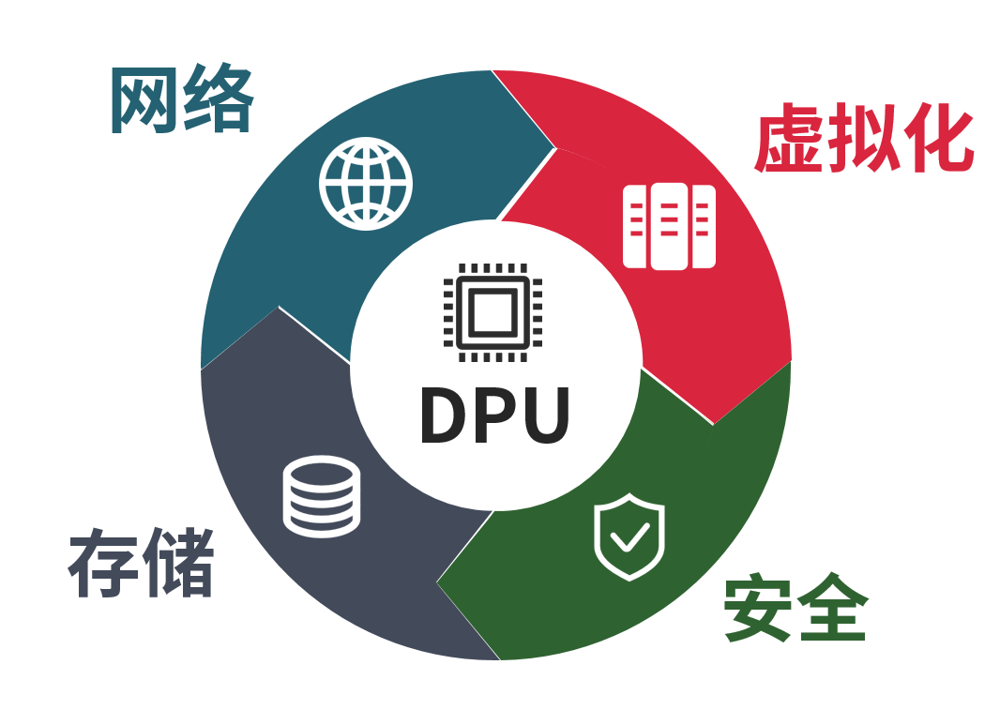

# NVIDIA BLUEFIELD DPU

  

## [科普：火遍全网的 DPU 到底是什么](https://www.itguowei.com/archives/19423.html)

* DPU 分担的工作可以归纳为四个关键词，分别是虚拟化、网络、存储以及安全。
* 
* DPU 是一个紧密围绕数据中心的概念。也就是说，它主要用于数据中心这种大规模算力场景，而非我们每个人的台式机、笔记本电脑或手机（至少目前不是）。
* DPU 服务于云计算，主要作用是提升数据中心等算力基础设施的效率，减少能耗浪费，进而降低成本。
* 在数据中心里，时时刻刻都有大量的数据在进行传输。主机在收发数据时，需要进行海量的⽹络协议处理。根据传统的计算架构，这些协议处理都是由 CPU 完成的。
* 有人统计过，想要线速处理 10G 的⽹络，需要的⼤约 4 个 Xeon CPU 的核。也就是说，仅仅是进行⽹络数据包的处理，就要占用⼀个 8 核⾼端 CPU ⼀半的算⼒。
* 就有公司提出了 SmartNIC （智能网卡）的概念，将网络协议处理的工作从 CPU “卸载”到网卡上，以此分担 CPU 的负载。
* 2015 年，云计算厂商 AWS 率先开始探索这种 SmartNIC 模式。他们收购了芯片厂商 Annapurna Labs ，并于 2017 年正式推出 Nitro 系统。同年，阿里云也官宣了有类似功能的神龙（ X-Dragon ）架构。
* 2019 年 3 月，英伟达花费 69 亿美元收购了以色列芯片公司 Mellanox 。英伟达将 Mellanox 的 ConnectX 系列高速网卡技术与自己的已有技术相结合，于 2020 年正式推出了两款 DPU 产品：BlueField-2 DPU 和 BlueField-2X DPU 。
* DPU 在 SmartNIC 的基础上，将存储、安全和虚拟化等工作负载也从 CPU 卸载到自己身上。
* 上世纪 90 年代末，以 VMWare 为代表的虚拟化技术刚刚出现的时候，完全是由软件进行模拟线的，缺乏硬件的支持，所以，性能很差，几乎难以使用。