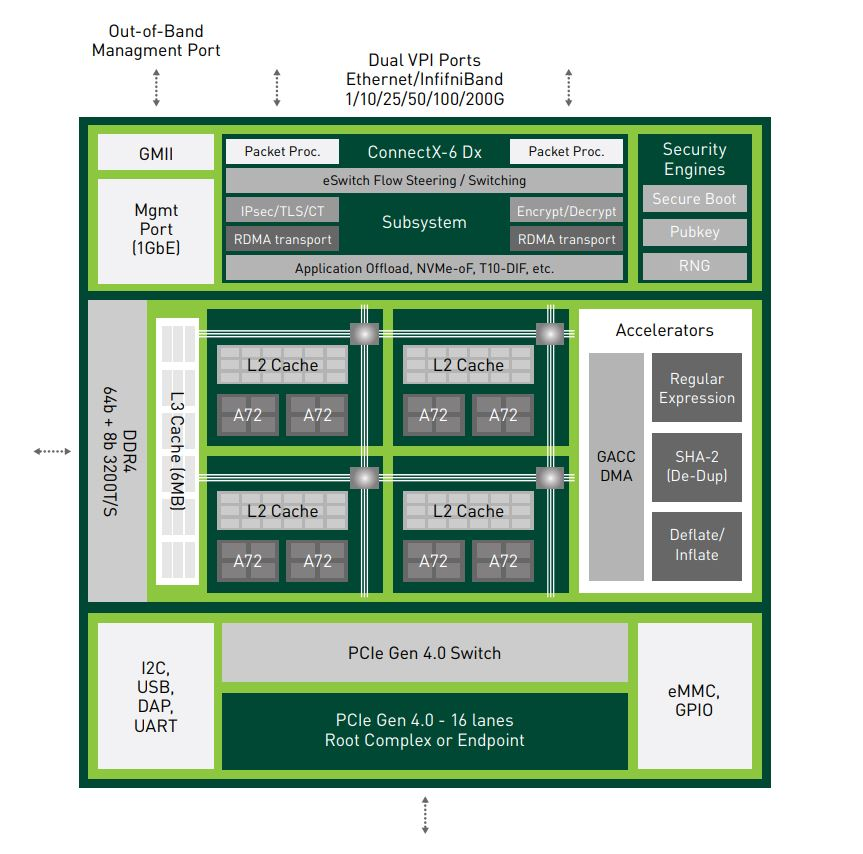
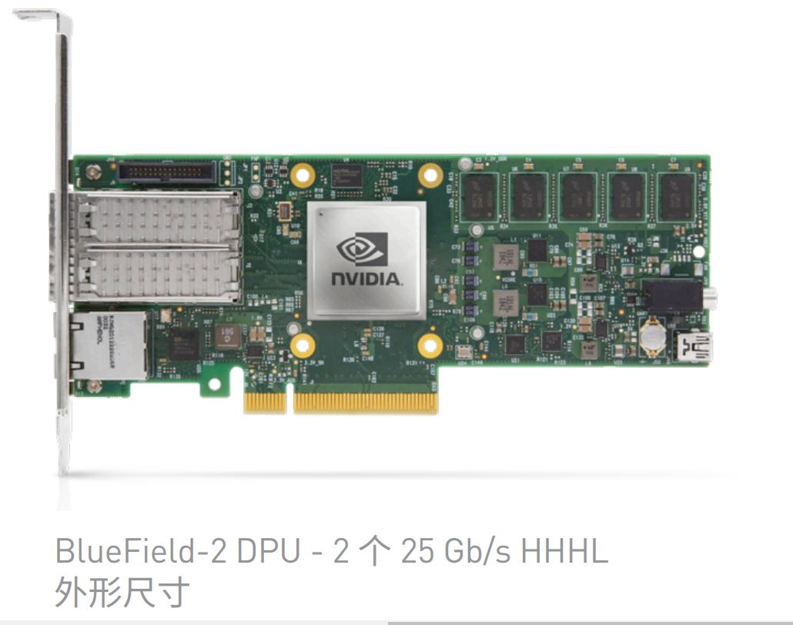
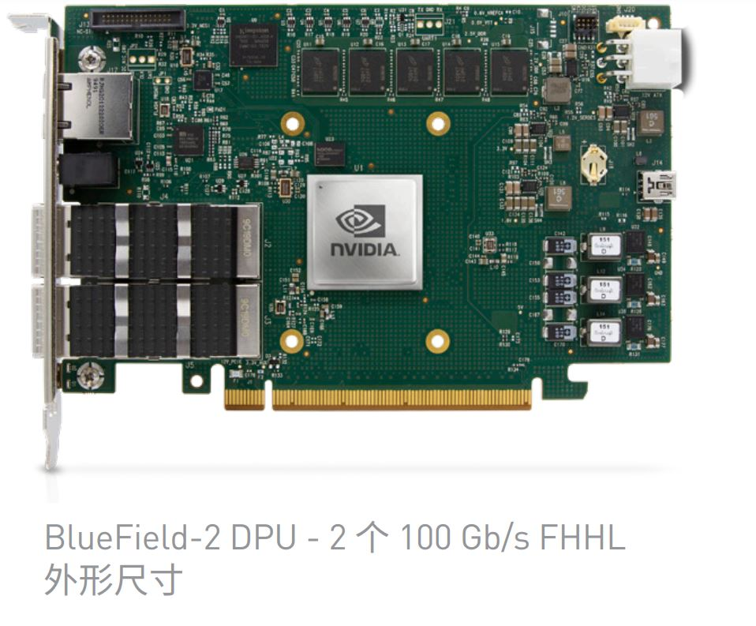
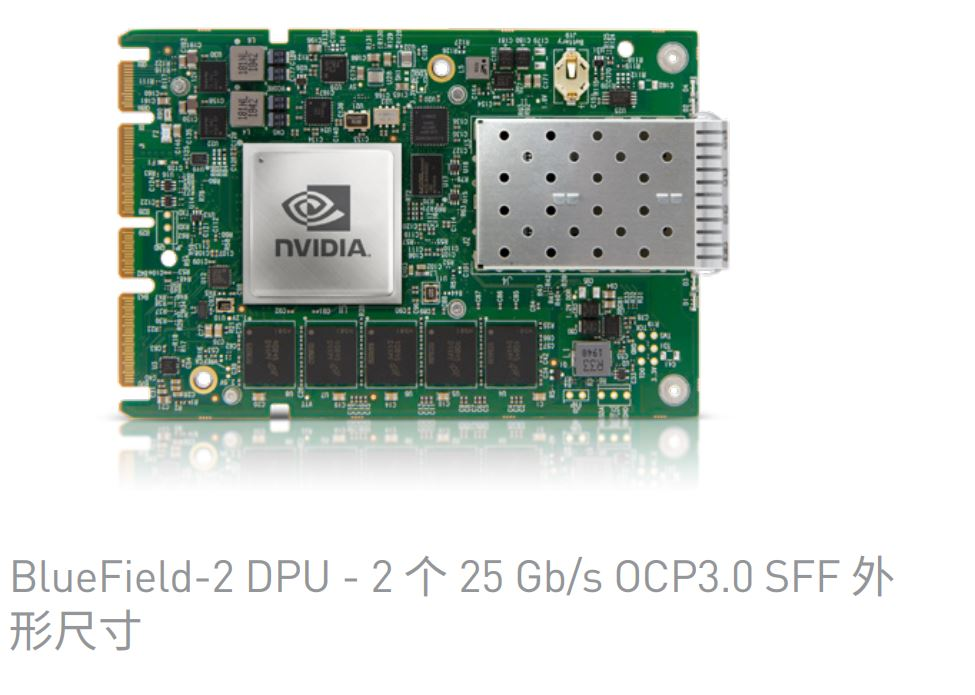
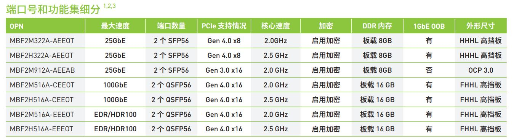
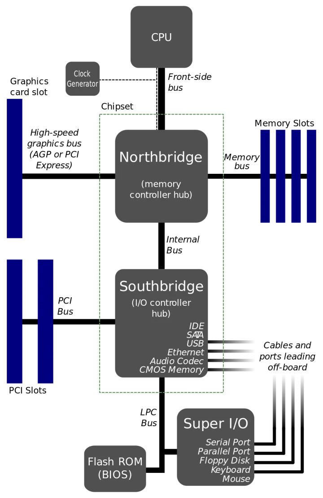

# NVIDIA BLUEFIELD DPU

## [NVIDIA BlueField数据处理器](https://www.nvidia.cn/networking/products/data-processing-unit/)
* 探索 NVIDIA BlueField DPU 可以卸载、隔离、加速和转换数据中心的各种方法。
* NVIDIA® BlueField® DPU（数据处理器）为现代数据中心和超级计算基础设施带来了前所未有的创新。通过对各种高级网络、存储和安全业务进行卸载、加速和隔离，BlueField DPU 可为云端、数据中心或边缘计算等环境中的各种工作负载提供安全、加速的基础设施。
* 
  

## [NVIDIA BLUEFIELD DPU(数据处理单元)](http://nvidia.zhidx.com/product-13.html)
* NVIDIA BlueField DPU (数据处理单元）引爆现代数据中心进行前所未有的创新，一颗芯片缩写了一个数据中心，集复杂的计算、网络、存储和安全等各种服务于一身，同时将各种资源的优化发挥到了极致。通过将行业领先的 ConnectX 网卡与 Arm CPU的结合，NVIDIA的首款DPU实现了理想的软件定义和硬件加速的完美融合，并通过其DOCA(数据中心基础设施级芯片架构 ) SDK为数据中心提供了全面的可编程性
* NVIDIA BlueField-2 DPU
  * NVIDIA BlueField-2 是世界上先进的 DPU，能够在每个主机上提供创新性加速和安全保护以及卓越的效率。BlueField-2 DOCA 将 ConnectX-6 Dx 的强大功能与可编程 Arm 核和硬件负载均衡功能相结合，适用于软件定义存储、网络、安全和管理工作负载。 NVIDIA BlueField-2 DPU 产品线还包含针对 NVMe 存储目标系统进行了优化的控制器，可提供卓越性能，并降低管理后端 NVMe 存储、全闪存阵列 (AFA) 和超融合系统的总体拥有成本。
* NVIDIA BlueField-2X AI 驱动型 DPU
  * 现在介绍全球第一款 AI 驱动型 DPU：NVIDIA BlueField-2X。这款先进的 DPU 具备 BlueField-2 的所有主要功能，并通过 NVIDIA Ampere 架构 GPU 的 AI 功能进行了增强。利用 NVIDIA 的第三代 Tensor Core 核心，它能够将 AI 用于实时安全分析，包括识别可能表示机密数据遭到窃取的异常流量，以线速分析加密流量，通过主机内省发现恶意活动，以及实现动态安全协调和自动化响应。
* 融合加速器
  * NVIDIA EGX™ 融合加速器既具备 NVIDIA Ampere 架构的强大性能，又具备 NVIDIA Mellanox 智能网卡与 DPU 技术的更高安全性和降低延迟的功能。医院、商店、仓库、工厂、机场和其他企业可以使用 EGX 融合加速器在企业数据中心和边缘打造更快捷、更高效的安全的 AI 系统。
* 数据中心基础设施级芯片架构 (DOCA)
  * 利用 NVIDIA DOCA SDK，开发者可以通过创建高性能、软件定义、云原生的 DPU 加速型服务，增强性能和安全功能，编写面向未来的数据中心基础架构程序。
* 适用于现代工作负载的优化服务器
  * NVIDIA 认证过的基于NVIDIA Ampere GPU 和 BlueField DPU 的系统可以实现真正的多节点扩展，并对各种流行的AI应用在加密环境下进行了优化和测试，例如在线加密、安全启动和微隔离等。NVIDIA DOCA SDK 已集成到 NVIDIA NGC Catalog 中，提供便利的容器化环境，便于第三方应用提供商利用 NVIDIA 认证过的系统上的先进数据中心加速技术，为最终客户开发、认证和发布应用。
* 技术参数:请参见原链接：[NVIDIA BLUEFIELD DPU(数据处理单元)](http://nvidia.zhidx.com/product-13.html)

  

## [NVIDIA MELLANOX BLUEFIELD-2 DATA PROCESSING UNIT (DPU)](https://network.nvidia.com/files/doc-2020/pb-bluefield-2-dpu.pdf)
* The NVIDIA Mellanox software package enables developers to fully utilize the BlueField-2
rich feature set and provides the following capabilities. 
  * Fully compatible with the first generation BlueField
  * Leverages the growing Arm ecosystem to create diverse solutions and tune the applications for maximum performance
  * Ubuntu/CentOS commercial distribution
  * Yocto Software Development Kit (SDK) with open API to enable customized development
  * Out-of-band 1GbE management interface
  

  

## [NVIDIA BlueField-3 DPU]()
* NVIDIA BlueField-3 是首款以线速处理软件定义网络、存储和网络安全的 DPU，速度可达 400 Gb/s。BlueField-3 将强大的计算能力、高速网络和广泛的可编程性相结合，为要求苛刻的工作负载提供软件定义的硬件加速解决方案。从加速 AI 到混合云和高性能计算，再到 5G 无线网络，BlueField-3 重新定义了可能性的艺术。

### [NVIDIA BLUEFIELD-3 DPU 可编程片上数据中心基础设施](https://www.nvidia.cn/content/dam/en-zz/Solutions/networking/data-processing-unit/datasheets/NVIDIA-BLUEFIELD-3-DPU%E5%8F%AF%E7%BC%96%E7%A8%8B%E7%89%87%E4%B8%8A%E6%95%B0%E6%8D%AE%E4%B8%AD%E5%BF%83%E5%9F%BA%E7%A1%80%E8%AE%BE%E6%96%BD.pdf)
* [NVIDIA BLUEFIELD-3 DPU PROGRAMMABLE DATA CENTER INFRASTRUCTURE ON-A-CHIP](https://www.nvidia.com/content/dam/en-zz/Solutions/Data-Center/documents/datasheet-nvidia-bluefield-3-dpu.pdf)
* NVIDIA® BlueField®-3 数据处理器（DPU）是第三代片上数据中心基础设施，支持客户组织从云到核心数据中心再到边缘计算，构建软件定义硬件加速的 IT 基础设施。通过 400Gb/s以太网或 NDR 400Gb/s InfiniBand 网络连接，BlueField-3 DPU 可以卸载、加速和隔离软件定义的网络、存储、安全和管理功能，从而显著提高数据中心的性能、效率和安全性。
* BlueField-3 在 I/O 路径中提供强大的计算能力和多种可编程加速引擎，能够满足性能要求严苛的应用程序的基础设施需求，同时可通过 NVIDIA DOCA™ 软件框架实现完全的软件向后兼容性。
* BlueField-3 DPU 将传统计算环境转换为安全、加速的虚拟私有云，使客户组织能够在安全的多租户环境下运行应用工作负载。BlueField-3 将数据中心基础设施与业务应用解耦，可提升数据中心安全性、简化运营并降低总体拥有成本。BlueField-3 支持 NVIDIA网络计算技术，助力新一代云原生超级计算平台，原生支持多节点租户隔离，提供极佳的裸机性能。

### [NVIDIA BLUEFIELD-2 DPU 芯片上的数据中心基础架构](https://www.nvidia.cn/content/dam/en-zz/Solutions/networking/data-processing-unit/datasheets/NVIDIA-Bluefield-2-DPU%E8%8A%AF%E7%89%87%E4%B8%8A%E7%9A%84%E6%95%B0%E6%8D%AE%E4%B8%AD%E5%BF%83%E5%9F%BA%E7%A1%80%E6%9E%B6%E6%9E%84.pdf)
* [NVIDIA BLUEFIELD-2 DPU Data Center Infrastructure on a Chip](https://www.nvidia.com/content/dam/en-zz/Solutions/Data-Center/documents/datasheet-nvidia-bluefield-2-dpu.pdf)
* BlueField-2 将行业领先的 NVIDIA Mellanox® ConnectX-6® Dx 网络适配器与 Arm®
核心阵列相结合，可提供具有完整软件可编程性的专用硬件加速引擎。每台服务器
边缘都配备经加速的 BlueField-2，可快速处理关键基础架构任务，提高数据中心效率。

* PCI-E接口的LP和FHHL是什么意思?
  * [PCI-E接口的LP和FHHL是什么意思?](https://zhidao.baidu.com/question/1546566821460840467.html)
    * FHHL即Full Hight Half Length，代表全高半长；
    * FHFL即Full Hight Full Length，代表全高全长；
    * 全高=111.28mm，半高=68.9mm；全长=312mm，半长=167.65mm
* [OCP3.0是个啥?](https://blog.csdn.net/xiaoqi976633690/article/details/122216280)
  * [OCP3.0是个啥?](https://blog.csdn.net/xiaoqi976633690/article/details/122216280)
    * 具体请参见上述链接。
    * OCP NIC 3.0规范支持两种基本卡尺寸:小尺寸Small Form Factor(SFF)和大尺寸Large Form Factor(LFF)。
    * SFF最多支持16 lane PCIe ，而LFF最多支持32 lane PCIe。
* 主板上的南北桥是什么东西？
  * [主板上的南北桥是什么东西？](https://www.zhihu.com/question/66881178)
    * 大体上说：北桥负责与CPU通信，并且连接高速设备（内存/显卡），并且与南桥通信；南桥负责与低速设备（硬盘/USB）通信，时钟/BIOS/系统管理/旧式设备控制，并且与北桥通信。
    * Intel从第一代Core i7 (i7 9xx)开始，将原属于北桥功能的内存控制器整合到CPU当中，在主流机Core i中(i7 8xx)更将PCI-e控制器（主要负责连接显卡）整合到CPU当中，这时候传统意义上的北桥的所有功能都已经整合到CPU内部了，所以Intel 50系芯片“组”（X58除外，这是搭配i7 9xx用的，还有北桥）已经没有传统意义的北桥了，而南桥依然负责处理低速设备（SATA/USB/PCI等）、时钟等功能。
    * 系统设计上将 I/O 工作层层转包。CPU 把比较慢的 bus 转包给北桥，北桥把更慢的 bus 转包给南桥，南桥把更更慢的 bus 转包给 Super I/O。
    * 
  * [南北桥芯片](https://baike.baidu.com/item/%E5%8D%97%E5%8C%97%E6%A1%A5%E8%8A%AF%E7%89%87/8657477)

### [NVIDIA 融合加速器](https://www.nvidia.cn/data-center/products/converged-accelerator/)
* NVIDIA 融合加速器采用一种独特的高效架构，汇聚了 NVIDIA GPU 的强大性能以及 NVIDIA 智能网卡 (SmartNIC) 和数据处理器 (DPU) 更强的网络功能和更高的安全性。为经由 GPU 加速的 I/O 密集型工作负载，包括从数据中心到边缘的各种工作负载，提供出色的性能和更高的安全性。
* 超强的 GPU 性能
  * NVIDIA® ConnectX® 系列智能网卡可提供一流的网络性能、先进的硬件卸载和加速功能。NVIDIA BlueField® DPU 将 ConnectX 的性能与完整的片内基础架构可编程性相结合。通过对网络、存储和安全服务进行卸载、加速和隔离，BlueField DPU 可为任意环境中的任意工作负载提供安全、加速的基础架构。
* 增强的网络和安全性
  * NVIDIA® ConnectX® 系列智能网卡（智能网卡可提供一流的网络性能、先进的硬件卸载和加速功能）。NVIDIA BlueField® DPU 将 ConnectX 的性能与完整的片内基础架构可编程性相结合。通过对网络、存储和安全服务进行卸载、加速和隔离，BlueField DPU 可为任意环境中的任意工作负载提供安全、加速的基础架构。
* 数据效率达到更高水平
  * NVIDIA 融合加速器包括集成的 PCIe 交换机，能够在 GPU 与网络之间传输数据，而无需流经服务器 PCIe 系统。这有助于使数据中心的性能、效率和安全性达到更高水平，从而更好地处理经由 GPU 加速的 IO 密集型工作负载。
* **[NVIDIA A30X 和 A100X](https://www.nvidia.com/content/dam/en-zz/Solutions/gtcf21/converged-accelerator/pdf/datasheet.pdf)**
  * NVIDIA A30X 结合了 NVIDIA A30 Tensor Core GPU 与 BlueField-2 DPU。在 MIG 的加持下，GPU 可以分为多达 4 个 GPU 实例，每个实例运行单独的服务。
  * 此加速卡的设计能够为 5G vRAN 和基于 AI 的网络安全等用例实现计算与 IO 性能的良好平衡。
  * NVIDIA A100X 集 NVIDIA A100 Tensor Core GPU 与 BlueField-2 DPU 的强大功能于一身。在 MIG 的加持下，每个 A100 可分为多达 7 个 GPU 实例，能够支持更多服务同时运行。
  * A100X 非常适合计算需求更密集的用例。这些用例包括需要大规模 MIMO 能力的 5G 应用、AI-on-5G 部署以及信号处理等专用工作负载。
* **[NVIDIA H100 CNX](https://www.nvidia.cn/data-center/)**
  * NVIDIA H100 CNX 将 NVIDIA H100 Tensor Core GPU 的功能与 NVIDIA ConnectX-7 智能网卡的先进网络功能相结合。NVIDIA H100 Tensor Core GPU 可为每个数据中心提供出色的性能、可扩展性和安全性。它使用用于万亿参数语言模型的专用 Transformer 引擎加速百亿亿次级 (Exascale) 工作负载，在执行小型作业时，可将其分成七个大小合适的 MIG 实例。凭借 NVIDIA 加速机密计算 (NACC)，这种可扩展的计算能力可以保护共享数据中心基础架构上的敏感应用程序。ConnectX-7 可提供高达 400 Gb/s 的带宽，并包含 NVIDIA ASAP2（加速交换和数据包处理™）以及用于加密和解密的在线硬件加速等创新功能。
  * H100 CNX 的独特架构可为 IO 密集型 GPU 工作负载（例如企业数据中心中的分布式 AI 训练和边缘的 5G 信号处理）提供出色性能。

### [NVIDIA BlueField-2 Ethernet DPU User Guide](https://docs.nvidia.com/networking/display/BlueField2DPUENUG/NVIDIA+BlueField-2+Ethernet+DPU+User+Guide)
* This user manual describes NVIDIA® BlueField®-2 Ethernet DPU (data processing unit). It provides details as to the interfaces of the board, specifications, required software and firmware for operating the board, and a step-by-step plan of how to bring up the BlueField-2 DPU.
* 本用户手册介绍了 NVIDIA® BlueField®-2 以太网 DPU（数据处理单元）。 它详细介绍了板的接口、规格、操作板所需的软件和固件，以及如何启动 BlueField-2 DPU 的分步计划。

### [PCI Express Specification](https://pcisig.com/specifications)
* [PCI Express 7.0 Specification](https://pcisig.com/specifications/pci-express-70-specification)
* [PCI Express 6.0 Specification](https://pcisig.com/pci-express-6.0-specification)

  

## [科普：火遍全网的 DPU 到底是什么](https://www.itguowei.com/archives/19423.html)

* DPU 分担的工作可以归纳为四个关键词，分别是虚拟化、网络、存储以及安全。
* 
* DPU 是一个紧密围绕数据中心的概念。也就是说，它主要用于数据中心这种大规模算力场景，而非我们每个人的台式机、笔记本电脑或手机（至少目前不是）。
* DPU 服务于云计算，主要作用是提升数据中心等算力基础设施的效率，减少能耗浪费，进而降低成本。
* 在数据中心里，时时刻刻都有大量的数据在进行传输。主机在收发数据时，需要进行海量的⽹络协议处理。根据传统的计算架构，这些协议处理都是由 CPU 完成的。
* 有人统计过，想要线速处理 10G 的⽹络，需要的⼤约 4 个 Xeon CPU 的核。也就是说，仅仅是进行⽹络数据包的处理，就要占用⼀个 8 核⾼端 CPU ⼀半的算⼒。
* 就有公司提出了 SmartNIC （智能网卡）的概念，将网络协议处理的工作从 CPU “卸载”到网卡上，以此分担 CPU 的负载。
* 2015 年，云计算厂商 AWS 率先开始探索这种 SmartNIC 模式。他们收购了芯片厂商 Annapurna Labs ，并于 2017 年正式推出 Nitro 系统。同年，阿里云也官宣了有类似功能的神龙（ X-Dragon ）架构。
* 2019 年 3 月，英伟达花费 69 亿美元收购了以色列芯片公司 Mellanox 。英伟达将 Mellanox 的 ConnectX 系列高速网卡技术与自己的已有技术相结合，于 2020 年正式推出了两款 DPU 产品：BlueField-2 DPU 和 BlueField-2X DPU 。
* DPU 在 SmartNIC 的基础上，将存储、安全和虚拟化等工作负载也从 CPU 卸载到自己身上。
* 上世纪 90 年代末，以 VMWare 为代表的虚拟化技术刚刚出现的时候，完全是由软件进行模拟线的，缺乏硬件的支持，所以，性能很差，几乎难以使用。
* 后来，2005 年，随着技术的演进，CPU 和内存的硬件虚拟化问题逐渐解决，才让虚拟化系统的性能有了大幅的提升，也激活了这项技术的发展前景和价值。众所周知，我们现在的整个云计算架构，都是基于虚拟化技术发展起来的。
* AWS 发布 Nitro 系统。这个系统除了 SmartNIC 之外，也完成了 I / O 的硬件虚拟化。它还将虚拟化管理程序 Hypervisior 从 CPU 卸载到专用硬件上。这样做带来的结果就是，虚拟化技术的性能损耗趋近于零，CPU 的负担进一步下降。
* 
* 存储：
  * 现在数据中心对存储读取和写入的速率要求很高。SSD 价格逐渐下降后，将 SSD 通过本地 PCIe 或高速网络与系统相连接，成为了一种主流的技术路线。针对分布式系统，在以往 InfiniBand 、 FC（Fiber Channel，光纤通道）、 Ethernet 的基础上，RDMA（Remote Direct Memory Access，远程直接数据存取）技术开始流行。
  * 在 RDMA 模式中，应用程序的数据，不再经过 CPU 和复杂的操作系统，直接和网卡通信。这就意味着，DPU 可以承担存储相关的高速接口标准协议处理，进一步为 CPU 分担压力。
* 安全：
  * 网络接口才是最理想的隐私边界。在网络接口上进行加密和解密，才是最合理的。所以，像国密标准的非对称加密算法 SM2 、哈希算法 SM3 和对称分组密码算法 SM4 等，其实都可以交给 DPU 进行计算。未来，区块链技术成熟应用后，相关算法也是可以从 CPU 卸载到 DPU 进行的。
* DPU 的作用本质，就是卸载、加速和隔离 —— 把 CPU 的部分工作卸载到自己身上；利用自己的算力特长，对这些工作进行加速运算；整个过程，实现了计算的隔离。
* DPU 是一个新型可编程多核处理器，是一块 SoC（System On Chip）芯片。它符合行业标准，具有很高的算力，还具备高性能的网络接口，能高速解析、处理数据，并高效地将数据传输到 CPU 和 GPU 。
* DPU 和 CPU 的最大不同，是 CPU 擅长通用性计算任务（什么任务都能接，比较“杂”），而 DPU 更擅长基础层应用任务（做特定的任务，比较“专注”），例如网络协议处理，交换路由计算，加密解密，数据压缩等“脏活累活”。所以说，DPU 是 CPU 的一个好帮手，将与 CPU 、 GPU 形成“铁三角”，彻底颠覆数据中心的运算模式。
* 以英伟达为例。继 BlueField-2 DPU 和 BlueField-2X 之后，2021 年 4 月，NVIDIA 又发布了新一代数据处理器 —— BlueField-3 DPU 。
* BlueField-3 DPU：
  * 这是首款为 AI 和加速计算而设计的 DPU 
  * 一个 BlueField-3 DPU 所提供的数据中心服务，可相当于多达 300 个 x86 核才能实现的服务。这就释放了大量的 CPU 资源，用于运行关键业务应用。
* DOCA
  * 英伟达专门推出了给 BlueField DPU 量身打造的软件开发平台 —— NVIDIA DOCA 。
  * DOCA 的全称叫 Data Center Infrastructure On A Chip Architecture ，即“线上数据中心基础设施体系结构”。借助于 DOCA ，开发人员能够利用行业标准的 API ，在 NVIDIA BlueField DPU 上快速创建网络，存储，安全和管理服务，以及 AI / HPC 的一系列应用程序和服务。
  * 在 2022 年 5 月，NVIDIA 发布了 DOCA 1.3 。该版本不仅新增了 121 个 API 开发接口，还添加了优化数据流插入的 DOCA Flow 库、通信通道库（ Communication Channel ）、正则表达式库（ Regular Expression ）和基于 OVN 的数据路径加密等功能，更添加了 HBN （基于主机的网络）等服务，深受开发者的欢迎。
* 根据预测，到 2025 年，DPU 全球市场容量预计将达到 120 亿美金。