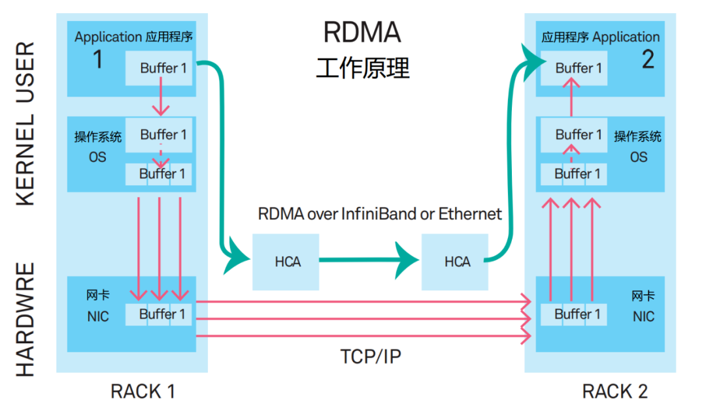

# NVIDIA BLUEFIELD DPU

## [NVIDIA BlueField数据处理器](https://www.nvidia.cn/networking/products/data-processing-unit/)
* 探索 NVIDIA BlueField DPU 可以卸载、隔离、加速和转换数据中心的各种方法。
* NVIDIA® BlueField® DPU（数据处理器）为现代数据中心和超级计算基础设施带来了前所未有的创新。通过对各种高级网络、存储和安全业务进行卸载、加速和隔离，BlueField DPU 可为云端、数据中心或边缘计算等环境中的各种工作负载提供安全、加速的基础设施。
* 
  

## [科普：火遍全网的 DPU 到底是什么](https://www.itguowei.com/archives/19423.html)

* DPU 分担的工作可以归纳为四个关键词，分别是虚拟化、网络、存储以及安全。
* 
* DPU 是一个紧密围绕数据中心的概念。也就是说，它主要用于数据中心这种大规模算力场景，而非我们每个人的台式机、笔记本电脑或手机（至少目前不是）。
* DPU 服务于云计算，主要作用是提升数据中心等算力基础设施的效率，减少能耗浪费，进而降低成本。
* 在数据中心里，时时刻刻都有大量的数据在进行传输。主机在收发数据时，需要进行海量的⽹络协议处理。根据传统的计算架构，这些协议处理都是由 CPU 完成的。
* 有人统计过，想要线速处理 10G 的⽹络，需要的⼤约 4 个 Xeon CPU 的核。也就是说，仅仅是进行⽹络数据包的处理，就要占用⼀个 8 核⾼端 CPU ⼀半的算⼒。
* 就有公司提出了 SmartNIC （智能网卡）的概念，将网络协议处理的工作从 CPU “卸载”到网卡上，以此分担 CPU 的负载。
* 2015 年，云计算厂商 AWS 率先开始探索这种 SmartNIC 模式。他们收购了芯片厂商 Annapurna Labs ，并于 2017 年正式推出 Nitro 系统。同年，阿里云也官宣了有类似功能的神龙（ X-Dragon ）架构。
* 2019 年 3 月，英伟达花费 69 亿美元收购了以色列芯片公司 Mellanox 。英伟达将 Mellanox 的 ConnectX 系列高速网卡技术与自己的已有技术相结合，于 2020 年正式推出了两款 DPU 产品：BlueField-2 DPU 和 BlueField-2X DPU 。
* DPU 在 SmartNIC 的基础上，将存储、安全和虚拟化等工作负载也从 CPU 卸载到自己身上。
* 上世纪 90 年代末，以 VMWare 为代表的虚拟化技术刚刚出现的时候，完全是由软件进行模拟线的，缺乏硬件的支持，所以，性能很差，几乎难以使用。
* 后来，2005 年，随着技术的演进，CPU 和内存的硬件虚拟化问题逐渐解决，才让虚拟化系统的性能有了大幅的提升，也激活了这项技术的发展前景和价值。众所周知，我们现在的整个云计算架构，都是基于虚拟化技术发展起来的。
* AWS 发布 Nitro 系统。这个系统除了 SmartNIC 之外，也完成了 I / O 的硬件虚拟化。它还将虚拟化管理程序 Hypervisior 从 CPU 卸载到专用硬件上。这样做带来的结果就是，虚拟化技术的性能损耗趋近于零，CPU 的负担进一步下降。
* 
* 存储：
  * 现在数据中心对存储读取和写入的速率要求很高。SSD 价格逐渐下降后，将 SSD 通过本地 PCIe 或高速网络与系统相连接，成为了一种主流的技术路线。针对分布式系统，在以往 InfiniBand 、 FC（Fiber Channel，光纤通道）、 Ethernet 的基础上，RDMA（Remote Direct Memory Access，远程直接数据存取）技术开始流行。
  * 在 RDMA 模式中，应用程序的数据，不再经过 CPU 和复杂的操作系统，直接和网卡通信。这就意味着，DPU 可以承担存储相关的高速接口标准协议处理，进一步为 CPU 分担压力。
* 安全：
  * 网络接口才是最理想的隐私边界。在网络接口上进行加密和解密，才是最合理的。所以，像国密标准的非对称加密算法 SM2 、哈希算法 SM3 和对称分组密码算法 SM4 等，其实都可以交给 DPU 进行计算。未来，区块链技术成熟应用后，相关算法也是可以从 CPU 卸载到 DPU 进行的。
* DPU 的作用本质，就是卸载、加速和隔离 —— 把 CPU 的部分工作卸载到自己身上；利用自己的算力特长，对这些工作进行加速运算；整个过程，实现了计算的隔离。
* DPU 是一个新型可编程多核处理器，是一块 SoC（System On Chip）芯片。它符合行业标准，具有很高的算力，还具备高性能的网络接口，能高速解析、处理数据，并高效地将数据传输到 CPU 和 GPU 。
* DPU 和 CPU 的最大不同，是 CPU 擅长通用性计算任务（什么任务都能接，比较“杂”），而 DPU 更擅长基础层应用任务（做特定的任务，比较“专注”），例如网络协议处理，交换路由计算，加密解密，数据压缩等“脏活累活”。所以说，DPU 是 CPU 的一个好帮手，将与 CPU 、 GPU 形成“铁三角”，彻底颠覆数据中心的运算模式。
* 以英伟达为例。继 BlueField-2 DPU 和 BlueField-2X 之后，2021 年 4 月，NVIDIA 又发布了新一代数据处理器 —— BlueField-3 DPU 。
* BlueField-3 DPU：
  * 这是首款为 AI 和加速计算而设计的 DPU 
  * 一个 BlueField-3 DPU 所提供的数据中心服务，可相当于多达 300 个 x86 核才能实现的服务。这就释放了大量的 CPU 资源，用于运行关键业务应用。
* DOCA
  * 英伟达专门推出了给 BlueField DPU 量身打造的软件开发平台 —— NVIDIA DOCA 。
  * DOCA 的全称叫 Data Center Infrastructure On A Chip Architecture ，即“线上数据中心基础设施体系结构”。借助于 DOCA ，开发人员能够利用行业标准的 API ，在 NVIDIA BlueField DPU 上快速创建网络，存储，安全和管理服务，以及 AI / HPC 的一系列应用程序和服务。
  * 在 2022 年 5 月，NVIDIA 发布了 DOCA 1.3 。该版本不仅新增了 121 个 API 开发接口，还添加了优化数据流插入的 DOCA Flow 库、通信通道库（ Communication Channel ）、正则表达式库（ Regular Expression ）和基于 OVN 的数据路径加密等功能，更添加了 HBN （基于主机的网络）等服务，深受开发者的欢迎。
* 根据预测，到 2025 年，DPU 全球市场容量预计将达到 120 亿美金。