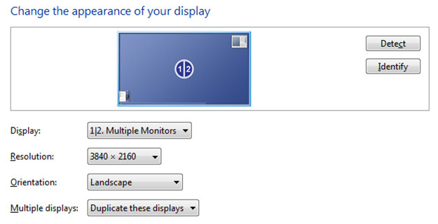
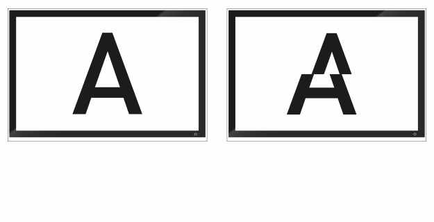
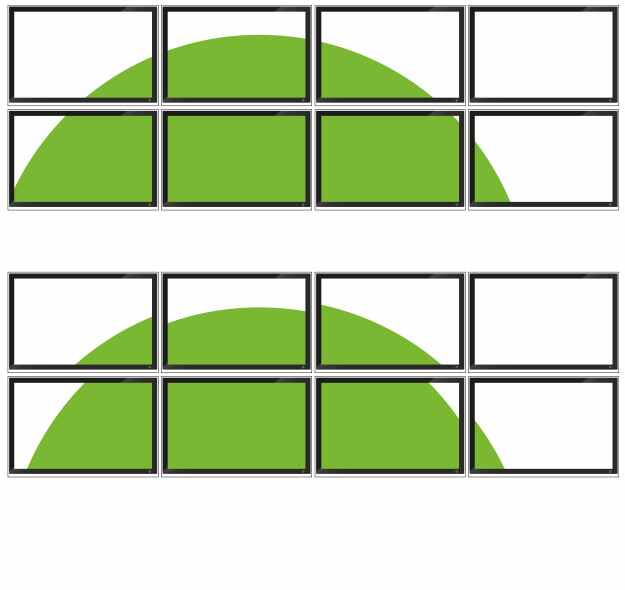
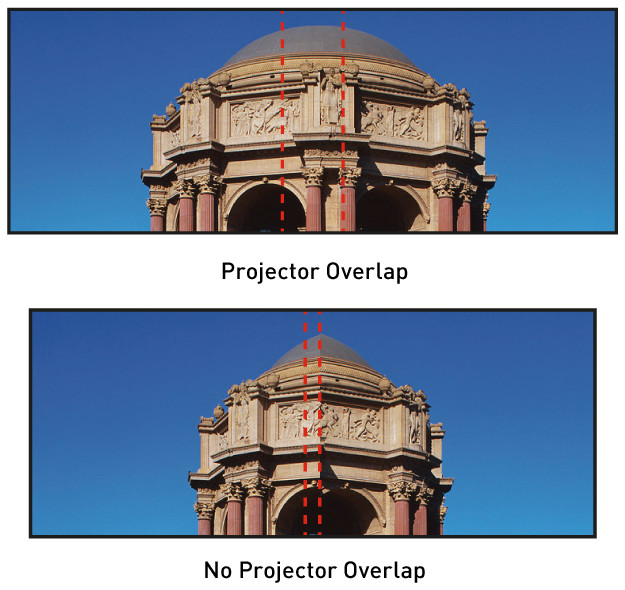
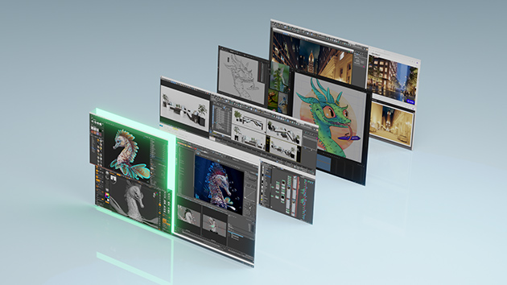

# [NVIDIA MOSAIC](https://www.nvidia.com/en-us/design-visualization/solutions/nvidia-mosaic-technology/)

***
  
***

## [NVIDIA MOSAIC](https://www.nvidia.com/en-us/design-visualization/solutions/nvidia-mosaic-technology/)

Whether you want to see your work across multiple displays or project your ideas in 4K, you can with NVIDIA Mosaic™ multi-display technology. With NVIDIA Mosaic, you can easily span any application across up to 16 high-resolution panels or projectors from a single system, conveniently treating the multiple displays as a single desktop, without application software changes or visual artifacts.

NVIDIA RTX and NVIDIA Quadro professional visualization products deliver the power of Mosaic technology, making it easy to configure a multi-display solution that expands your view.

无论您是想在多台显示器上看到您的作品，还是想以 4K 投影您的想法，您都可以使用 NVIDIA Mosaic™ 多显示器技术。 借助 NVIDIA Mosaic，您可以轻松地将任何应用程序跨越单个系统中多达 16 个高分辨率面板或投影仪，方便地将多个显示器视为单个桌面，而无需更改应用程序软件或视觉伪影。

NVIDIA RTX 和 NVIDIA Quadro 专业可视化产品提供强大的 Mosaic 技术，让您轻松配置多显示器解决方案以扩展您的视野。

 

### KEY FEATURES

* UNIFIED DESKTOP
  * The system views multiple displays as a single unified desktop environment without software customization or performance degradation.
  * 
* SEAMLESS IMAGE
  * See a flawless image without any tearing artifacts from a fully synchronized display environment across more than one card. Available on NVIDIA Quadro M4000 and higher.
  * 从多张卡上完全同步的显示环境中看到没有任何撕裂伪影的完美图像。 适用于 NVIDIA Quadro M4000 及更高版本。
  * 
* BEZEL CORRECTION
  * View a fully aligned image across multiple displays by accommodating for the gap between the monitors' bezels.
  * 通过适应显示器边框之间的间隙，在多个显示器上查看完全对齐的图像。
  * 
* PROJECTOR OVERLAP
  * Create a single, unified desktop image from multiple projectors that support blending. Available on NVIDIA Quadro K1200 and higher.
  * 
* DESKTOP MANAGEMENT
  * Easily manage a multi-display environment with NVIDIA RTX Desktop Manager. Have full control with complete flexibility to create a personalized desktop environment.
  * 

***
  
***

## [NVIDIA MOSAIC](https://www.nvidia.cn/design-visualization/solutions/nvidia-mosaic-technology/)
* 是上述官网主页的中文版本

***
  
***

## [NVIDIA RTX Desktop Manager](https://www.nvidia.com/en-us/design-visualization/software/rtx-desktop-manager/)

这部分没什么实质性的内容，需要的时候可以直接看网页的链接。

Professional workflows require the use of multiple applications and windows across several monitors whether you’re tracking financial markets, creating digital content, or designing products. And while managing your desktop is key to maximizing your productivity, not every workspace fits the way you need to work. NVIDIA RTX™ Desktop Manager software allows you to manage single or multi-monitor workspaces with ease, giving you maximum flexibility and control over your display real estate and desktops.

无论您是跟踪金融市场、创建数字内容还是设计产品，专业的工作流程都需要在多个显示器上使用多个应用程序和窗口。 虽然管理桌面是最大限度提高工作效率的关键，但并非每个工作空间都适合您需要的工作方式。 NVIDIA RTX™ 桌面管理器软件让您可以轻松管理单显示器或多显示器工作区，为您提供最大的灵活性和对显示器空间和桌面的控制。

 

### Make the Most of Your Workspace

NVIDIA RTX Desktop Manager, included with your NVIDIA RTX Enterprise/Quadro driver or downloadable as a standalone app, helps you maximize productivity by optimizing your workspace layout. It also helps you work faster through the following streamlined features and functions:
  * Tailored workspaces with easy navigation through individual windows and dialog boxes.
  * Compatibility with top applications across industries that can be loaded, launched, and organized with one click.
  * Powerful window management and deployment tools for a customized desktop experience.

 

### Advanced Desktop Management Features

 

### [Collaborate, Work, and Play with NVIDIA RTX Experience](https://www.nvidia.com/en-us/design-visualization/software/rtx-desktop-manager/)

 

### [Multi-Display Solutions](https://www.nvidia.com/en-us/design-visualization/solutions/quadro-display-desktop-management/)

***
  
***

## [Multi-Display Solutions](https://www.nvidia.com/en-us/design-visualization/solutions/quadro-display-desktop-management/)

NVIDIA RTX™ professional products feature the most advanced display technologies and interfaces to create the ultimate visual workspace for maximum productivity and dynamic large-scale visualization. Easily deploy and manage single or multiple displays on a desktop, drive head-mounted displays, build expansive digital signage walls, and create immersive high-resolution stereoscopic environments.

NVIDIA RTX™ 专业产品采用最先进的显示技术和界面，可打造终极视觉工作空间，实现最高生产力和动态大规模可视化。 在桌面上轻松部署和管理单个或多个显示器、驱动头戴式显示器、构建扩展的数字标牌墙，并创建身临其境的高分辨率立体环境。

* Digital Signage (数字标牌)
* Interactive Displays
* Operational Control
* Product Design Review
* Spectacle Displays

## 

|||
|:-:|:-:|
|flawless|完美的、无懈可击|
|accommodate|容纳、适应|
|bazel|边框挡板|
|spectale|奇观、壮观场面、场面、舞台场面|
