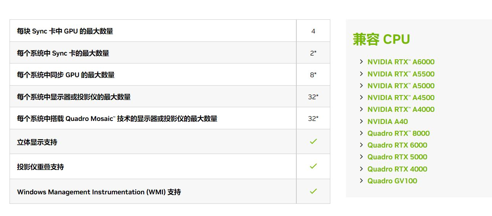
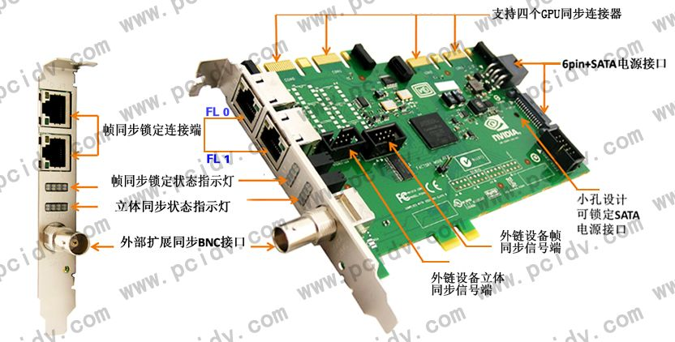

# [NVIDIA Quadro Sync](https://www.nvidia.com/en-us/design-visualization/solutions/quadro-sync/)

***
  
***

## [NVIDIA Quadro Sync](https://www.nvidia.com/en-us/design-visualization/solutions/quadro-sync/)
* 官方主页：[NVIDIA Quadro Sync](https://www.nvidia.com/en-us/design-visualization/solutions/quadro-sync/)
* 中文官方主页：[NVIDIA Quadro Sync](https://www.nvidia.cn/design-visualization/solutions/quadro-sync/)
  * 利用 NVIDIA® Quadro® Sync 解决方案，用户可以在多台显示器上实现流畅同步，打造炫目的超高分辨率画面，来满足各行各业的可视化和展示需求。
  * Quadro Sync 板卡的设计充分考虑到灵活性和可扩展性，能够连接特定的 NVIDIA RTX 和 NVIDIA Quadro GPU，后者可与其所连接的显示器或投影仪同步。Quadro Sync 在这些同步的显示器和投影仪上还支持 NVIDIA Mosaic 技术，提供了一种扩展任意应用分辨率的简单方式。
* [QUADRO SYNC II USER GUIDE](https://images.nvidia.com/content/quadro/product-literature/user-guides/Quadro-Sync-II-User-Guide-v06.pdf)
  * 具体信息请参见这篇用户指导

***
  
***

## [英伟达同步卡Nvidia Quadro SYNC II](http://www.plink-ai.com/cn/product/Nvidia-Quadro-SYNC-II.html)

基于Quadro Sync II 同步卡的Quadro Sync解决方案可以使用一个或多个系统同步到多达32个4K显示器显示输出，即使全3D立体显示输出也不会出现图像伪影。

 

 

* MOSAIC：多屏联合输出超大分辨率
  * Quadro Sync解决方案支持NVIDIA MOSAIC多屏显示技术。MOSAIC是一种将多个显示器或投影仪组合为单个虚拟显示器输出的技术。
  * MOSAIC通过减去屏幕边框后面的区域以创建单个统一的显示表面来创建投影仪重叠区域。借助双Quadro Sync II 同步卡和受支持的Quadro GPU，最多可将32个显示器显示为操作系统或在其上运行的任何应用程序之一。

 

* 打造无限可能的渲染扩展显示输出
  * 基于Quadro Sync II 同步卡的NVIDIA Quadro Sync方案可以用灵活且可扩展的方式部署超高分辨率显示系统。这样用户只需借助一个系统就能驱动由多达32个4K显示器组成的视频墙，用以播放广播画面。同时，利用相同规模的可视化集群，飞行模拟程序可以从高清分辨率投影仪提升至四路输入的4K投影仪。而对研究实验室来说，仅使用一个系统即可打造出由多达32个显示器组成的3D立体显示墙。这将使得科研、设计渲染甚至是工业研究变得无往不利。
  

***
  
***

## Quadro SYNC显示信号帧同步卡多屏锁相mosaic马赛克多显卡跨屏拼接SLI卡
* 这个链接所使用的卡还是上一代的Quadro Sync卡
* 具体信息可参见上述链接

***
  
***

## [基于NVIDIA的nDisplay同步方案——如何为虚拟制片设置nDisplay与NVIDIA GPU同步](https://docs.unrealengine.com/4.27/zh-CN/WorkingWithMedia/IntegratingMedia/nDisplay/Synchronization/ndisplay-synchronization-with-nvidia/)
* 为了避免LED屏幕之间出现画面撕裂现象，同时避免摄像机在各个LED屏幕上拍到不一致的内容，你必须确保nDisplay群集节点（即电脑）实现同步。

## 

|||
|:-:|:-:|
|accessory|配饰、附件、附属品|
|vibration|震动、震荡、发抖|
|latch|闩锁、锁存器|
|unplug|拔、拔掉|
