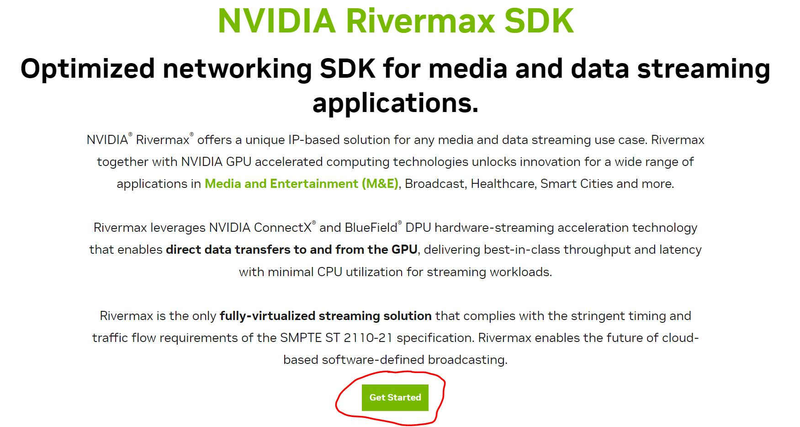
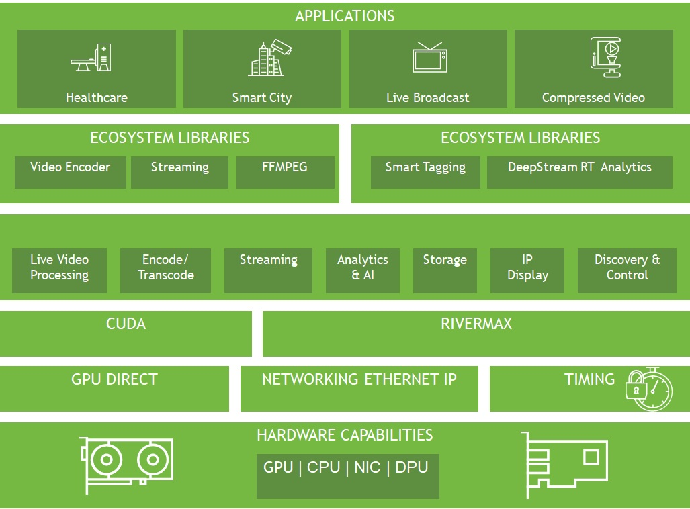
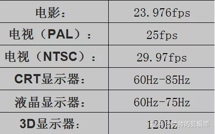
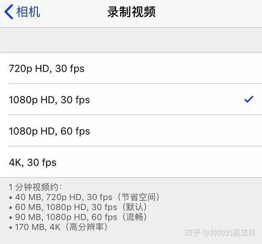
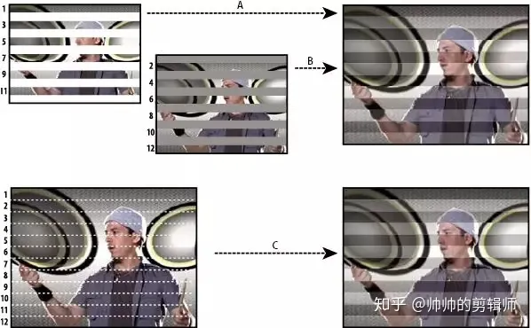
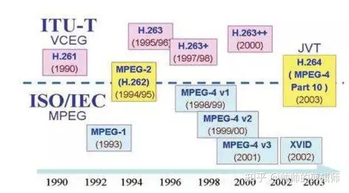

## [NVIDIA Rivermax SDK](https://developer.nvidia.com/networking/rivermax)

### 参考链接：[NVIDIA Rivermax SDK](https://developer.nvidia.com/networking/rivermax)
* 需要先申请使用
* 
* 申请使用后，点击"Get Started"进入如下页面：[Rivermax Getting Started](https://developer.nvidia.com/networking/rivermax-getting-started)
* [NVIDIA Rivermax Media Library User Manual v12](https://developer.download.nvidia.com/networking/secure/Rivermax-Linux-SDK/Installation-Package/Version-1.20.x/docs/Rivermax_Media_Library_User_Manual-v12.pdf?wTI_K5vfHKqZtabQb_rWDgRuFt_Krucg118ZZY15lDesvcRe3i-Azzv0_Uhu79mUOvp0ZJ6M6ZS-Rt6X0BuMnpOBpyaTqyhBpsACla4JCeleJJEEvZpK96y7iILCyl8eEjmsW2dJ--W1mM5jiUjfQJwKJwBj46VWUUF_EkZqzSo2tIj4wBQtrOAJqahr2yt2EICsEfPEd3Tjse_zmx7P95YAOZ7fAH9hqc_jGcvMUyR-f49dz_Jg&t=eyJscyI6ImdzZW8iLCJsc2QiOiJodHRwczovL3d3dy5nb29nbGUuY29tLmhrLyIsIm5jaWQiOiJzby1saW5rLTc1Mjk3OC12dDIwIn0=)
  * 这是sdk手册
* Powerful & Flexible SDK
  * 

 

### [NVIDIA Rivermax Product Presentation](https://nvidia.highspot.com/items/5fae121e628ba212df8ac7d4?lfrm=srp.0#36)
  * 重要的内容，这一部分要详细看。

  

### [NVIDIA Rivermax 加速一切流数据传输](https://developer.nvidia.com/zh-cn/blog/streaming-everything-with-rivermax/)
* 这篇blog暂时看来没啥参考价值，废话连篇。

  

### [NVIDIA RIVERMAX Unique IP-Based Video Streaming Library for Media and Entertainment](https://developer.nvidia.com/sites/default/files/akamai/networking/rivermax/NVIDIA-Rivermax-Datasheet.pdf)

  

## 常见问题

1. JT-NM测试是什么？
   * [JOINT TASKFORCE ON NETWORK MEDIA](https://www.jt-nm.org/)
     * JT-NM: OINT TASKFORCE ON NETWORK MEDIA, 网络媒体联合工作组 (JT-NM)
     * Our mission is to help drive development of a packet-based network infrastructure for the professional media industry by bringing together manufacturers, broadcasters and industry organizations to create, store, transfer and stream professional media.
     * 我们的使命是通过汇集制造商、广播公司和行业组织来创建、存储、传输和流式传输专业媒体，帮助推动专业媒体行业基于数据包的网络基础设施的发展。
   * [JT-NM Reference Architecture](https://static.jt-nm.org/RA-1.0/JT-NMReferenceArchitecturev1.0%20150904%20FINAL.pdf)
     * What is JT-NM?
     * Purpose, Motivation and Scope
       * The mission of the Joint Task Force on Networked Media is as follows: In an open, participatory environment, help to drive development of an interoperable packet-based network infrastructure for the professional media industry by bringing together manufacturers, broadcasters and industry organizations with the objective to create, store, transfer and stream professional media.
       * That said, this is not a Standard upon which systems will be based, but rather a collection of best practices, recommendations, and frameworks which readers may choose to implement. It is expected that this Reference Architecture will evolve over time. However, those considering implementing professional networked media infrastructures are encouraged to review the suggestions contained in this document and to begin implementing them as soon as practical. 
       * 也就是说，这不是系统所依据的标准，而是读者可以选择实施的最佳实践、建议和框架的集合。 预计该参考架构将随着时间的推移而发展。 但是，我们鼓励那些考虑实施专业网络媒体基础设施的人员查看本文档中包含的建议，并在可行的情况下尽快开始实施。
   * [ST 2110测试基础知识](https://cloud.tencent.com/developer/article/1684226)
     * SMPTE ST 2110作为JT-NM测试计划的一部分，为工厂中的新设备和现有设备开发验证测试计划提供了理想起点。
   * [SMPTE ST 2110 概论](https://blog.csdn.net/Cidd0422/article/details/103331388)
     * 而一个血统纯正的 2110 系统中， 干路上跑的是三种流。视频、音频、辅助数据流分开传输，就免去了刚才提的 加嵌 / 解嵌 这种麻烦事。而且这么传输不光提升了系统的可扩展性，系统的带宽限制也更富有弹性。但随之而来的是对同步的更高要求：比起2022-6的单一流，同步三种不同的流要难得多，所以 2110 采用了 PTP协议与RTP时间戳等方式同步，这也是 2110-10的内容。
     * 具体请参见原文链接。
   * [真正的互联互通 ——SMPTE ST 2110](https://www.imaschina.com/article/54892.html)
   * [基于 IP 的视频](https://www.siemon.com/docs/default-source/china-library-by-tz/whitepaper/%E7%99%BD%E7%9A%AE%E4%B9%A6-%E5%9F%BA%E4%BA%8Eip%E7%9A%84%E8%A7%86%E9%A2%91(2004).pdf?sfvrsn=73458633_2)

  

1. 基于IP的视频，所谓的IP是指什么？
   * [什么是IP视频及其工作原理？](https://zh-cn.fmuser.net/content/?7456.html)
     * IP视频中的“ IP”代表“ Internet协议”。
   * [基于TCP/IP的音视频传输](https://van23li.github.io/2021/09/22/%E5%9F%BA%E4%BA%8ETCP-IP%E7%9A%84%E9%9F%B3%E8%A7%86%E9%A2%91%E4%BC%A0%E8%BE%93/)
     * 一个完整的视频文件，包括音频、视频和基础元信息，我们常见的视频文件如mp4、mov、flv、avi、rmvb等视频文件，就是一个容器的封装，里面包含了音频和视频两部分，并且都是通过一些特定的编码算法，进行编码压缩过后的。
     * H264、Xvid等就是视频编码格式，MP3、AAC等就是音频编码格式。例如：将一个Xvid视频编码文件和一个MP3音频编码文件按AVI封装标准封装以后，就得到一个AVI后缀的视频文件。
     * 数据编码
       * 使用相关硬件或软件对音视频原始数据进行编码处理（数字化）及加工（如音视频混合、打包封装等），得到可用的音视频数据
       * 涉及技术或协议：
            * 编码方式：CBR、VBR
            * 编码格式：
              * 视频：H.265、H.264、MPEG-4等，封装容器有TS、MKV、AVI、MP4等
            *   音频：G.711μ、AAC、Opus等，封装有MP3、OGG、AAC等
      * 将编码完成后的音视频数据进行传输，早期的音视频通过同轴电缆之类的线缆进行传输，IP网络发展后，使用IP网络优传输;
    * [H.264视频压缩技术](https://van23li.github.io/2021/09/22/%E5%9F%BA%E4%BA%8ETCP-IP%E7%9A%84%E9%9F%B3%E8%A7%86%E9%A2%91%E4%BC%A0%E8%BE%93/#3h264%E8%A7%86%E9%A2%91%E5%8E%8B%E7%BC%A9%E6%8A%80%E6%9C%AF):为实现在较低宽带环境下实现图像的快速传输，ITU-T和IEO/IEC两大国际标准化组织联手制定了这新一代视频压缩标准，即H.264视频压缩标准。其压缩性能好于 MEPG-4，应用目标范围宽，满足不同速率解析度；编码效率上，在相同的重建图像质量下，能够比 h.263 节约 50%的码率；在传输上，能够在有限带宽的 TCP/IP 网络中以较低的数据速率传输视频流，并且在压缩效率，数据包恢复能力以及视频质量超越现有的视频编码方式。

  

3. 码率是什么？
    * [码率是什么？比特率是干嘛的？帧速率是啥？分辨率又是什么？](https://zhuanlan.zhihu.com/p/75804693)
      * 帧
        * 一般来说，我们制作视频常用的帧数只有几种：24帧、25帧、29.97帧以及30帧。
      * 帧速率
        * 帧速率也称为FPS(Frames PerSecond)的缩写——帧/秒。
        * 
        * 如果帧率超过屏幕刷新率只会浪费图形处理的能力，因为监视器不能以这么快的速度更新，这样超过刷新率的帧率就浪费掉了
        * iphone7的相机参数:
        * 
      * 分辨率
      * 场序（隔行扫描和逐行扫描）
        * 最初电视机每秒要传输的图像被定为50帧。认为这样图像在我们眼中才不闪烁。但是根据当时的技术让广播电视达到50帧每秒的传输很难实现，科学家利用人类视觉的滞留性，发明了隔行传输。
        * 隔行扫描是为使用受限带宽传送电视信号开发的技术。在隔行扫描系统中，一次仅传送视频每个帧的一半数量的水平行。由于传送速度、显示器余辉以及视觉暂留现象，观看者能够以完整分辨率感知每个帧。所有的模拟电视标准均使用隔行扫描技术。数字电视标准包括隔行扫描和非隔行扫描两种技术。
        * 
      * 码流（码率）
        * 码流(Data Rate)是指视频文件在单位时间内使用的数据流量，也叫码率或码流率，通俗一点的理解就是取样率,是视频编码中画面质量控制中最重要的部分，一般我们用的单位是kb/s或者Mb/s。一般来说同样分辨率下，视频文件的码流越大，压缩比就越小，画面质量就越高。码流越大，说明单位时间内取样率越大，数据流，精度就越高，处理出来的文件就越接近原始文件，图像质量越好，画质越清晰，要求播放设备的解码能力也越高。
      * 比特率
      * 常见编码模式：
        * VBR（Variable Bitrate）动态比特率
        * ABR（Average Bitrate）平均比特率
        * CBR（Constant Bitrate），常数比特率
    * 视频编码格式
      * AVI（Audio Video Interleave）:AVI格式上限制比较多，只能有一个视频轨道和一个音频轨道（现在有非标准插件可加入最多两个音频轨道），还可以有一些附加轨道，如文字等。AVI格式不提供任何控制功能。
      * WMV（Windows Media Video）同样是微软开发的一组数字视频编解码格式的通称，ASF（Advanced Systems Format）是其封装格式。
      * MPEG（Moving Picture Experts Group）,MPEG的控制功能丰富，可以有多个视频（即角度）、音轨、字幕（位图字幕）等等。
      * Matroska
      * Real Video Real Media（RM）是由RealNetworks开发的一种档容器。RM，尤其是可变比特率的RMVB格式，没有复杂的Profile/Level，制作起来较H.264视频格式简单，非常受到网络上传者的欢迎。此外很多人仍有RMVB体积小高质量的错误认知，这个不太正确的观念也导致很多人倾向使用rmvb，事实上在相同码率下，rmvb编码和H.264这个高度压缩的视频编码相比，体积会较大。rm/rmvb
      * QuickTime File Format是由苹果公司开发的容器。
      * 
  * [关于码率](https://blog.csdn.net/qq_41176800/article/details/110848678)
    * 码率，也称比特率 Bit Rate，或叫位速率，是单位时间内视频（或音频）的数据量，单位是 bps (bit per second，位每秒），一般使用 kbps（千位每秒）或Mbps（百万位每秒）。
    * 影响码率大小的因素
      * 分辨率, 分别对 1080p 和 4K 的视频用 5Mbps 进行编码压缩，编码器会更多地压缩 4K 的视频从而达到 5Mbps 的码率，所以，画质反而比不上 1080p。
      * 帧速率
      * 色彩空间位深度
      * 编码器
        * 不同的编码器由于压缩算法等不同，最终的编码质量也就有差异。比如，目前使用 H.264 在 5Mbps 码率下编码，图像质量比采用其他编码器好。即便是 H.264，内部也有不同的画质级别选择。
          * “基线”配置文件 Baseline profile：多应用于实时通信领域。
          * “主要”配置文件 Main profile：多应用于流媒体领域。
          * “高”配置文件 High profile：多应用于广电和存储领域。使用“高”配置文件可比“主要”配置文件降低 10% 的码率。

  

