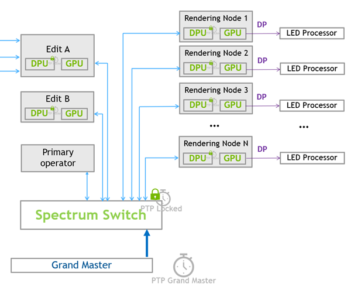
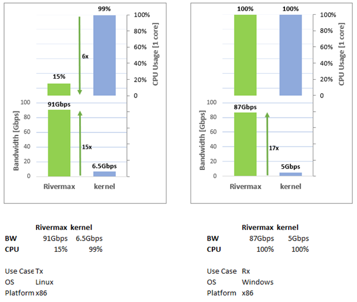

# [腾讯互娱内容生态部与NVIDIA 深度合作，打造低延迟超大分辨率渲染平台](https://blogs.nvidia.cn/2023/01/10/nvidia-and-tencent-cdd-ultra-large-resolution-rendering-platform/)

作为国内游戏大厂，腾讯早早布局虚拟制片业务。2020年底，腾讯游戏成立内容生态部门（Content Development Department，以下简称CDD），旗下拥有虚拟人、虚拟制片等多个业务线。2021年11月CDD在深圳坪山建成了总占地3000平米的LED虚拟影棚。影棚配置有40m*6m的240°弧形LED立面屏幕，并配有可上下移动的100多平方米的天幕。LED点间距2.3，支持高速拍摄。 

* 客户挑战 
  * 在虚拟影棚中，LED立面屏幕被分割为多个显示区域，每个显示区域由不同的工作站驱动，其呈现的内容则由其搭载的GPU渲染完成.
  * 在实时拍摄过程中，需要LED光照、实时摄像机追踪和实时渲染投屏三者的结合，实现前台演员和虚拟背景之间的完美整合。这种拍摄方案消除了对绿幕合成的需求，让摄像机直接拍摄最终成像。 
  * 目前鲜有人在这一领域取得突破，原因可以归纳为以下几个方面： 
    * 每台工作站需要独立渲染特定显示区域的内容，在保证高标准画面渲染细节的同时还需要维持面板刷新一致，对GPU性能提出了极高要求。 
    * 节点间存在通讯障碍，普通同步方式不能保证所有节点的帧同步，一旦出现不同步就会造成画面撕裂影响观看体验。 
    * 节点间参数同步和数据传输占用了大量的网络带宽和CPU资源，进一步造成节点间时间同步的不可预测。 
* 应用方案 
  * 
  * 新的平台由NVIDIA RTX A6000承担分布式实时渲染任务。RTX A6000拥有48GB显存，可以将拍摄场景需要的模型和纹理数据全部加载到显存中，在拍摄过程中按需调用。
  * 渲染节点支持多 GPU 进行视口渲染，此模式支持创作者指定一个 GPU 渲染特定视口，并通过 NVLink将渲染结果直接复制到另一个 GPU上显示输出。
  * 此外整个渲染平台通过添加NVIDIA BlueField-2 DPU和NVIDIA Spectrum-3交换机，具备了运行NVIDIA Rivermax整体方案的硬件能力。
  * NVIDIA Rivermax 提供了高性能的流媒体传输服务，这种服务在Windows平台上实现了GPU Direct P2P支持，消除了额外的GPU显存到系统内存的拷贝，降低了操作系统层面的延迟，同时也降低了CPU资源的占用，从而让整个渲染平台的运行更为可靠。启用NVIDIA Rivermax后，单颗CPU 核心可以轻松收发100Gbps的媒体流。
  *   
* 使用效果及影响 
  * 腾讯CDD综合NVIDIA提供的各项产品，
    * 使用NVIDIA RTX A6000实时渲染，
    * 使用NVIDIA Rivermax在GPU显存间直接传输数据，
    * 使用NVIDIA BlueField-2 DPU 部署精确时间服务
    * 使用DOCA Firefly来同步所有渲染节点的系统时钟，
    * 使用NVIDIA Spectrum-3 交换机复制GPU显存数据并承载时钟网络，
    * 通过这一系列改进措施，最终实现了在LED立面屏幕上以超低延迟呈现数字流资产的能力。 