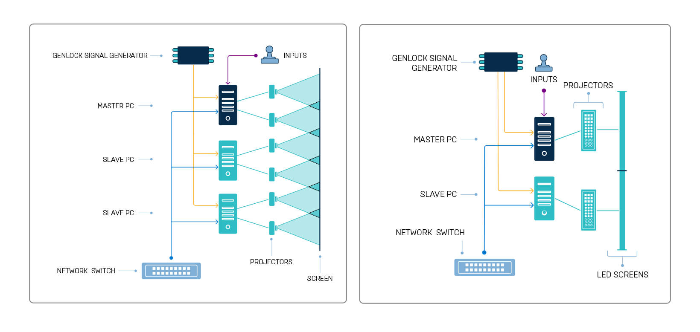

# nDisplay

## [使用nDisplay在多显示屏上进行渲染](https://docs.unrealengine.com/5.0/zh-CN/rendering-to-multiple-displays-with-ndisplay-in-unreal-engine/)
* 虚幻引擎通过一个名为 nDisplay 的系统为这些使用场景提供支持。该系统可以解决将3D内容同时渲染到多个显示屏的一些最重要的挑战:
  * 它有助于完成在网络中的不同计算机上部署和启动多个项目实例的过程，并且这些计算机各自可以渲染到一个或多个显示设备。
  * 它根据显示硬件的空间布局，管理每一帧下每个屏幕的视锥体所涉及的所有计算工作。
  * 它确保各个屏幕上显示的内容保持"完全"同步，将确定性内容分发到所有引擎实例。
  * 它提供无源和有源立体声渲染。
  * 它可以受VR跟踪系统输入的驱动，这样显示屏中的视点就可以准确地实时跟随移动观众的视点。
  * 它足够灵活，可以支持任意相对方向的任意数量的屏幕，并可以在任意数量的项目中轻松复用。
* [Explore nDisplay technology: limitless scaling of real-time content](https://www.unrealengine.com/en-US/tech-blog/explore-ndisplay-technology-limitless-scaling-of-real-time-content)
  * 中文版本：[探究nDisplay技术：实时内容的无限制缩放](https://www.unrealengine.com/zh-CN/tech-blog/explore-ndisplay-technology-limitless-scaling-of-real-time-content)
  * To display such a large volume of real-time pixels, the rendering of each frame needs to be distributed over a network of machines—with each machine rendering just a section of a frame—and then each frame must be displayed with precise matching of section edges, all at exactly the same time.
  * To facilitate such a complex process, Epic Games has introduced nDisplay technology for Unreal Engine. nDisplay combines network configuration data, details about display mechanisms, distribution of rendering, and image display for large surfaces and screens.
  * 
  * Who uses large displays?
    * Live events
    * Military training applications
    * Immersive real-time sets for filmmaking

  

## [nDisplay中的同步机制——介绍多台显示器如何进行同步](https://docs.unrealengine.com/4.27/zh-CN/WorkingWithMedia/IntegratingMedia/nDisplay/Synchronization/)
* 确定性
* 硬件同步和同步锁定（Genlock）
* 显示同步详解
* 菊花链和直接Genlock
* NVIDIA Mosaic和AMD EyeFinity
* 显示同步的其他方面
* 同步策略

  

## [基于NVIDIA的nDisplay同步方案——如何为虚拟制片设置nDisplay与NVIDIA GPU同步](https://docs.unrealengine.com/4.27/zh-CN/WorkingWithMedia/IntegratingMedia/nDisplay/Synchronization/ndisplay-synchronization-with-nvidia/)
* 

## [Rendering to Multiple Displays with nDisplay](https://docs.unrealengine.com/5.0/en-US/rendering-to-multiple-displays-with-ndisplay-in-unreal-engine/)

## [nDisplay Overview](https://docs.unrealengine.com/5.0/en-US/ndisplay-overview-for-unreal-engine/)

## [nDisplay 3D Config Editor](https://docs.unrealengine.com/5.0/en-US/ndisplay-3d-config-editor-in-unreal-engine/)
* [nDisplay 3D配置编辑器](https://docs.unrealengine.com/4.27/zh-CN/WorkingWithMedia/IntegratingMedia/nDisplay/ConfigurationViewer/)
* nDisplay Config Asset: This asset defines the computers that make up your cluster network, the characteristics of the windows and viewports you want the Unreal Engine to render on each computer, the display device's topology and configuration, the parts of the virtual world each viewport should render, the types of input devices you want to accept, and more.

|||
|:-:|:-:|
|military|军事、军队、军用|